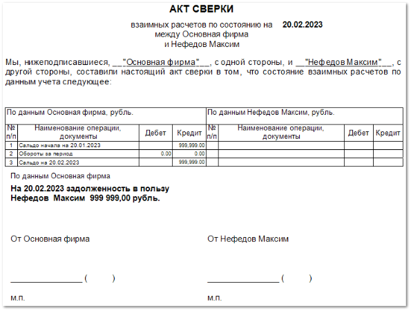

Отчет позволяет получить информацию о балансе между выбранным контрагентом и **Нашей фирмой**. Баланс высчитывается по документам за указанный промежуток времени.

Отчет содержит:

- Конечную дату формирования отчета;

- нформацию о сторонах, между которыми составлен акт сверки;

- **Табличную часть**, которая заполняется со стороны **Нашей фирмы** и со стороны контрагента для осуществления сверки.  Табличная часть включает в себя следующую информацию:

    - **№ п/п** – порядковый номер записи в таблице;

    - **Наименование операции, документы** – наименование расходных и корректировочных документов (т.е. документов по которым присутствует обращение денежных средств) между **Нашей фирмой** и **Контрагентом**, с датой формирования и наименованием **Контрагента**;

    - **Дебет** – сумма денежных средств, поступивших на счет **Нашей фирмы**;

    - **Кредит** – сумма задолженности **Нашей фирмы** перед **Контрагентом**;

- Итоговую информацию о задолженности. В случае, если задолженность есть, указывается в чью пользу задолженность;

- Место для подписи и проставления печати.

::: info Примечание

В первой и последней строке **Табличной части** выводится информация о начальном и конечном **Сальдо**, т.е. информация об остатке по счету на начало и конец заданного периода. **Начальная** и **Конечная** даты задаются при формировании отчета.

:::

::: info Примечание

Столбцы для заполнения в **Табличной части** для **Нашей фирмы** и **Контрагента**, с которым осуществляется сверка, идентичны.

:::