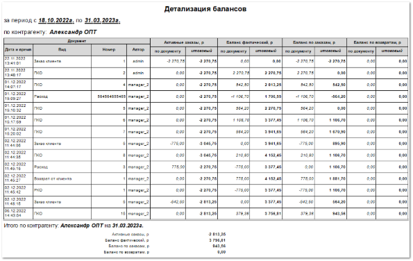

Отчет раскрывает историю формирования балансов контрагента.

**Отчет содержит**:

- Период, за который сформирован отчет, в соответствии с выбранными в параметрах;

- Наименование **Контрагента**, по которому сформирован отчет;

- **Табличную часть**, которая включает в себя следующую информацию:

    - **Дата и время** – дата и время создания документа, повлиявшего на баланс, по заданному контрагенту;

    - **Вид** – наименование созданного документа (**Заказ клиента**, **Расход**, **Платежное поручение входящее**, **Оплата по банковской карте**, **ПКО**, **Возврат от клиента**, **Возврат по банковской карте**, **РКО)**;

    - **Номер** – порядковый номер созданного документа;

    - **Автор** – пользователь, сформировавший документ;

    - **Активные заказы** – отражает денежную сумму, на которую в данный момент числятся заказы по контрагенту;

    - **Баланс фактический** – отражает фактический баланс между накладными, возвратами, корректировками и платежными документами;

    - **Баланс по заказам** – является суммой значений баланса **Активные заказы** и **Баланса фактического**. Указывает на возможность контрагента оплатить свои заказы;

    - **Баланс по возвратам** – отражает ситуацию по возвратам, выделяя из **Баланса фактического** сумму возвратов по товарам с учетом платежей.

::: info Примечание

Значение всех балансов выводится:

- **по документу** – сумма баланса по документу; 

- **итоговый** – общая сумма, которая отражается на балансе; Формирование балансов происходит в соответствии с принципом формирования балансов в программе.

:::

- **Итого по контрагенту** – итоговые суммы, которые числятся на балансах контрагента.

::: details Читайте также

[Принцип формирования балансов в программе](../../klienty/dobavlenie/printsip_formirovaniya_balansov_v_programme.md) 

:::