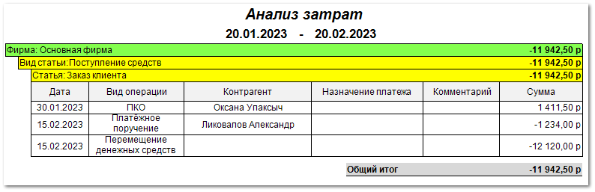

В отчете отображается информация по затратам **Нашей фирмы** за выбранный период.

**Отчет** Движение денег – анализ затрат **содержит**:

- Период, за который сформирован отчет, в соответствии с выбранными в параметрах;

- **Табличную часть**, которая включает в себя следующую информацию:

    - **Дата** – дата операции (продажи, возврата и т.д.);

    - **Вид операции** – название вида операции (**Платежное поручение входящее**, **ПКО**, **Оплата по банковской карте**, **Платежное поручение**, **РКО**, **Возврат по банковской карте**);

    - **Контрагент** – наименование контрагента по которому проводилась операция;

    - **Назначение платежа** – графа идентификации платежа, в которой указывается договор, по которому была проведена операция и назначение – за что были перечислены денежные средства. В графе отображаются данные из поля **Назначение платежа** из платежного документа;

    - **Комментарий** – документ (с номером), на основании которого была проведена операция, дата и время создания документа, наименование клиента из документа, сумма документа;

    - **Сумма** – значение суммы проведенной операции;

- **Общий итог** – общая сумма значений из колонки **Сумма**.