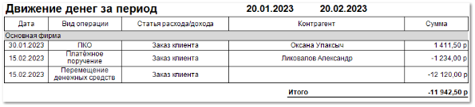

В отчете отображается информация по движению денежных средств за выбранный период.

**Отчет** Движение денег **содержит:**

- Период, за который сформирован отчет, в соответствии с выбранными в параметрах;

- **Табличную часть**, которая включает в себя следующую информацию:

    - **Дата** – дата операции (продажи, возврата и т.д.);

    - **Вид операции** – название вида операции (**Платежное поручение входящее**, **ПКО**, **Оплата по банковской карте**, **Платежное поручение**, **РКО**, **Возврат по банковской карте**);

    - **Статья расхода/ дохода** – значение статьи расхода/дохода по каждой операции, если соответствующее поле было заполнено в платежном документе;

    - **Контрагент** – наименование контрагента по которому проводилась операция;

    - **Сумма** – значение суммы проведенной операции;

- **Итог** – общая сумма значений из колонки **Сумма**.