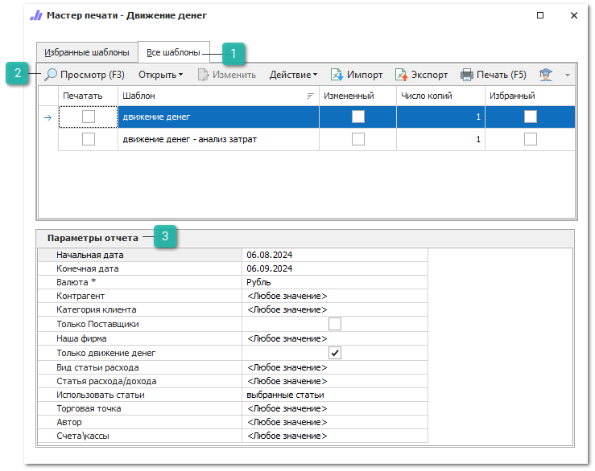
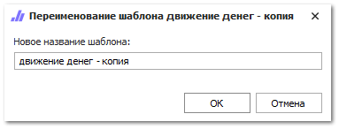

Чтобы сформировать **Финансовый отчет** выполните следующие действия:

**»** Откройте раздел **Отчеты и анализ ► Финансовые отчеты**.

**»** Выберите требуемый вариант отчета.

 **Все шаблоны**

Список доступных шаблонов отчета, позволяет выбрать необходимый для формирования отчет, а так же добавить шаблона в избранные.

 **Панель действий**

Панель состоит из следующих команд:

- **Просмотр (F3)** – позволяет открыть печатную форму для просмотра перед печатью;

- **Открыть** – позволяет открыть документ в выбранном формате. Содержит выпадающий список со следующими командами:

    - **В Word** – позволяет открыть документ в формате **\*.docx**;

    - **В Excel** – позволяет открыть документ в формате **\*.xlsx**;

    - **В PDF** – позволяет открыть документ в формате **\*.pdf**.

- **Изменить** – позволяет открыть редактор шаблонов для внесения изменений;

::: note Замечание

Команда недоступна при редактировании стандартных шаблонов. Редактирование доступно только для шаблонов, которые были скопированы (команда **Действие** ► **Копировать**) или импортированы (команда **Импорт**).

:::

- **Действие** – содержит выпадающий список команд для взаимодействия с шаблоном:

    - **Удалить** – удаляет выбранный шаблон. Команда доступна при выборе только измененных шаблонов;

    - **Копировать** – копирует выбранный шаблон. При нажатии на команду производится открытие окна с вводом наименования нового шаблона;

    - **Переименовать** – позволяет открыть окно для изменения наименования шаблона. Команда доступна только для шаблонов, которые не являются стандартными.

::: note Замечание

Сохранение шаблона недоступно, если:

- название содержит спец. символы "\",  "/",  ":",  "\*",  "?",  """, "<",  ">",  "|"; 

- название не указано; 

- название и тип шаблона совпадают с уже имеющимся в базе данных.

:::

- **Импорт** – позволяет загрузить файл с шаблоном в расширении \*.mrt;

- **Экспорт** – позволяет выгрузить выделенный в табличной части шаблон, в файл с расширением \*.mrt;

- **Печать (F5)** – позволяет распечатать выбранные шаблоны;

- **Помощь** – позволяет открыть руководство пользователя на странице описания формы мастера печати.

 **Параметры отчета**

Позволяет задать необходимые параметры, наборы параметров отличаются в зависимости от выбранного отчета:

- **Начальная дата/Конечная дата** – даты начала и окончания формирования отчета;

- **Валюта\*/Валюта выгрузки \*** – выбор валюты для конвертации сумм в отчете с учетом действующего курса валюты. Параметр обязателен для заполнения. Доступен выбор только одной валюты;

- **Контрагент/Клиенты** – выбор контрагента, по которому будет сформирован отчет. В зависимости от отчета доступен выбор одного или нескольких Контрагентов;

- **Категория клиента** – выбор категории клиента для формирования отчета;

- **Наша фирма/Наши фирмы** – выбор фирмы, документы которой попадут в отчет. В зависимости от отчета доступен выбор одной или нескольких фирм;

- **Торговая точка** – значение торговой точки, документы которой попадут в отчет. Доступен выбор только одной **Торговой точки**;

- **Автор** – пользователь, сформировавший документ;

- **Счета/кассы** – выбор значения счета/ кассы через которые проводились операции;

- **Статья расхода/дохода/Статья расхода и дохода платежного документа** – выбор статей **Расхода**/ **Дохода**, из добавленных в разделе **Настройки программы ► Наши фирмы** по которым будет сформирован отчет;

- **Только Поставщики** – для формирования отчета с информацией о движении денежных средств между **Нашей фирмой** и **Поставщиками**;

- **Только движение денег** – флажок, проставлен по умолчанию, служит для выведения в отчет финансовых транзакций с признаком "Движение денег";

- **Виды статьи расхода** – выбор статей расхода (раздел **Управление** ► **Настройки программы** ► вкладка **Наши фирмы**) по которым будет сформирован отчет;

- **Использовать статьи** – позволяет изменять критерии отбора по настройке **Статья расхода/ дохода**. Для выбора доступны значения:

    - **выбранные статьи** – позволяет сделать выборку статей в соответствии со значением, проставленным в **Статье расхода/ дохода**;

    - **кроме выбранных** – позволяет сделать выборку статей за исключением значений, которые проставлены в **Статье расхода/ дохода**;

- **Виды платежных документов** – выбор вида платежных документов из существующих **(Приходный кассовый ордер**, **Платежное поручение входящее**, **Оплата по банковской карте**). Доступен выбор одного или нескольких значений;

- **Виды оплачиваемых документов** – выбор вида документов, по которым производилась оплата;

- **Группа товара** – выбор группы товаров, по которой будет формироваться отчет. Доступен выбор только одной группы;

- **Товар** – выбор конкретного товара для формирования отчета. Доступен выбор только одного товара;

- **Текущая дата** – дата на момент построения отчета;

- **Поставщик** – поставщик, по которому необходимо определить сумму долга **Нашей фирмы**;

- **Количество дней расчета** – количество дней для подсчета задолженности;

- **С учетом возвратов** – опция, позволяющая построить отчет с учетом **Возвратов поставщику**;

- **Менеджер** – выбор пользователя, по клиентам которого будет сформирован отчет.

- **Альтернативная валюта** – дополнительное значение валюты для конвертации сумм в отчете с учетом действующего курса валюты;

- **Период группировки** –  период времени, за который нужно группировать данные в таблице (день, неделя, месяц, год);

- **Учитывать заказ-наряд** – указывается, учитывать или нет при формировании отчета данные из **Заказ-нарядов**. Доступные значения:

    - **Не использовать** – при расчете не будут учитываться документы **Заказ-Наряд**;

    - **Только товары** – будут учитываться только оплаченные товары из **Заказ-Нарядов**;

    - **Товары и работы** – будут учитываться оплаченные товары и работы из **Заказ-Нарядов**.

**»** Выберете шаблон, на основе которого нужно сформировать отчет.

**»** В блоке **Параметры отчета** задайте необходимые параметры.

**»** Откройте отчет в необходимой программе или распечатайте его.

::: details Читайте также

- [Настройки программы - Наши фирмы](../../../specification/upravlenie/nastrojki_programmy/nashi_firmy.md) 

:::