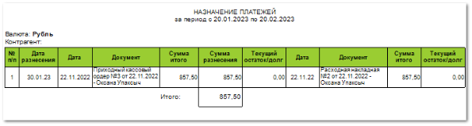

Отчет отражает разнесение документов и текущие остатки (долги) по ним. В отчете можно увидеть разнесение платежных документов (**ПП**, **ППвх**, **ПКО**, **РКО, ОБК, ВБК**), накладных (**ПН**, **РН**), **Заказ-нарядов** и возвратов (**ВК**, **ВП**), в том числе взаимозачеты. Позволяет контролировать, какие платежи за указанный период закрывают/не закрывают долг по каким документам и отслеживать, какой не разнесенный остаток от платежа можно использовать для закрытия долгов по контрагентам. Данные упорядочены по дате разноски.

В бланке **Назначение платежей** по каждому разнесению выводится:

- Период, за который сформирован отчет, в соответствии с выбранными в параметрах;

- **Валюту**, в которой велись взаиморасчеты (из разнесенных платежных документов);

- **Контрагент** – наименование контрагента по которому был сформирован отчет. Значение выводится если при формировании отчета был задан параметр **Контрагент**.

- **Табличная часть**, которая включает в себя следующую информацию:

    - **Дата разноски** – дата разнесения документов;

    - **Дата** – дата документа, который выступает в качестве платежа;

    - **Документ** – если в разноске платеж и накладная, то выводится платеж. Если в разноске два платежа (**ППвх**/**ПКО** и **ПП**/**РКО**) – входящий платеж. Если в разноске две накладных (**ПН** и **РН**) – **Приходная накладная**. Если в разноске накладная и возврат – выводится накладная;

    - **Сумма итого** – сумма документа, который выступает в качестве платежа;

    - **Сумма разнесения** – сумма разнесенных оплат по документу;

    - **Текущий остаток/долг** – остаток по документу, который выступает в качестве платежа;

    - **Дата документа** – дата документа, который выступает в качестве оплачиваемого;

    - **Документ** – если в разноске платеж и накладная, то выводится накладная. Если в разноске два платежа (**ППвх**/**ПКО** и **ПП**/**РКО**) – исходящий платеж. Если в разноске две накладных (**ПН** и **РН**) – **Расходная накладная**. Если в разноске накладная и возврат – выводится возврат;

    - **Сумма итого** – сумма документа, который выступает в качестве оплачиваемого;

    - **Текущий остаток/долг** – долг по документу, который выступает в качестве оплачиваемого.

    - **Итого** – итоговая сумма разнесенных документов.