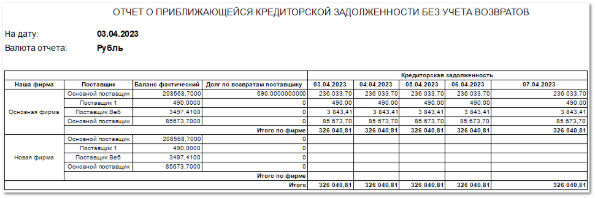

Отчет показывает кредиторскую задолженность **Нашей фирмы** перед поставщиками на дату формирования отчета, а также плановый график оплат на заданное количество дней. По умолчанию – 5 календарных дней.

Кредиторская задолженность в отчете представлена в виде календаря плановых оплат по **Приходным накладным** за вычетом **Корректировок приходных накладных** с нарастающим итогом. Для расчета плановой даты оплаты используется параметр **Отсрочка платежа, дн** в карточке контрагента.

::: info Примечание

Если у **Нашей фирмы** перед поставщиками имеется просроченная кредиторская задолженность, она включается в календарь плановых оплат, начиная с даты формирования отчета.

:::

Отчет содержит:

- **Дату** формирования – подставляется текущая дата;

- Информацию о **Валюте**, в которой сформирован отчет;

- **Табличную часть**, которая включает в себя следующую информацию:

    - **Наша фирма** – значение **Нашей фирмы** от имени которой был размещен заказ поставщику, по которому есть задолженность;

    - **Поставщик** – наименование поставщика, которому был размещен заказ;

    - **Баланс фактический** – общий баланс по взаиморасчетам с **Поставщиком** (с учетом всех задолженностей/переплат);

    - **Долг по возвратам поставщику** – в зависимости от выбранного значения **С учетом возврато**в при настройке формирования отчета, значение рассчитывается по разному:

        - Предстоящая кредиторская задолженность **без учета** **Возвратов поставщикам** рассчитывается как сумма просроченной кредиторской задолженности и планового платежа на дату оценки предстоящей кредиторской задолженности.

        - Предстоящая кредиторская задолженность **с учетом** **Возвратов поставщикам** рассчитывается как сумма просроченной кредиторской задолженности и планового платежа на дату оценки предстоящей кредиторской задолженности за минусом суммы документов **Возврат поставщику**.

    - **Кредиторская задолженность** – задолженность на ближайшие N календарных дней (в соответствии с параметром **Количество дней расчета**. При формировании учитываются документы, приближающиеся по сроку к оплате;

    - **Итого по фирме** – значение **Кредиторской задолженности** для отдельной **Нашей фирмы**;

    - **Итого** – итоговое значение **Кредиторской задолженности** по всем **Нашим фирмам**.

::: info Примечание

Если **Приходные накладные** были оплачены, т.е. в программе были созданы платежи, но при этом они не были разнесены на **ПН**, такие **ПН** будут включены в календарь плановых оплат.

:::