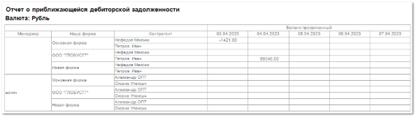

Отчет дает прогноз **на 5 дней вперед** о приближающейся дебиторской задолженности клиентов перед **Нашей фирмой** от начальной даты, выбранной в параметрах отчета.

Для прогноза используется свойство **Отсрочка платежа, дн** из **Расходных накладных**. Для отчета анализируются все **РН** по выбранным контрагентам:

- Из **РН** вычитаются накладные, которые **на момент окончания дня** должны уйти в просроченные (также вычитаются **РН**, по которым отсрочка равна 0).

- Полученная сумма непросроченных **РН** прибавляется к балансу фактическому: если получается положительное число, то баланс просроченный равен 0; если получается отрицательное число, то оно выводится в колонку отчета **Баланс просроченный** на соответствующий день расчета (его окончания).

::: note Пример

Формула расчета **Баланса просроченного**: БП = БФ + (∑ РН – ∑ РНпроср).

:::

Отчет содержит:

- Информацию о **Валюте**, в которой сформирован отчет;

- **Табличную часть**, которая включает в себя следующую информацию:

    - **Менеджер** – ответственный за контрагента сотрудник. Значение подставляется из карточки **Контрагента**;

    - **Наша фирма** – наименование **Нашей фирмы**, по клиентам которой выводится информация о предстоящей дебиторской задолженности;

    - **Баланс просроченный** – суммы приближающейся дебиторской задолженности по контрагенту на ближайшие 5 календарных дней.

    ::: info Примечание

    Значения сумм **Просрочено** в отчетах о текущей и дебиторской задолженности рассчитываются на разные промежутки времени и по разным формулам.
    
    В отчете о текущей дебиторской задолженности: просроченность определяется на текущий момент (в точности до минут), а долг определяется по суммам разнесения.
    
    В отчете о предстоящей дебиторской задолженности: просроченность определяется как **Баланс просроченный** на конец дня (каждого из 5), независимо от сумм разнесений по документам. 

    :::

    - **Контрагент** – наименование контрагента, по которому выводится информация.