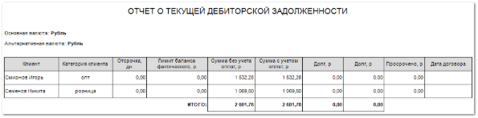

Отчет отражает информацию о задолженностях покупателей, а также об объеме их покупок за весь период совместной работы.

Текущая дебиторская задолженность определяется как сумма долга по **РН**, отсрочка платежа по которым **на дату формирования отчета** (т.е. на текущий момент) закончилась. Долг по **РН** означает, что **Сумма разнесений** по этому документу меньше **Суммы итого** **РН**. Все показатели отчета можно выводить как в основной валюте отчета, так и в альтернативной.

Отчет содержит:

- Информацию об **Основной** и **Альтернативной** **валюте**, в которой сформирован отчет;

- **Табличную часть**, которая включает в себя следующую информацию:

    - **Клиент** – название клиента, по которому выводиться информация;

    - **Категория клиента** – значение поля **Актуальная категория** из карточки контрагента;

    - **Отсрочка, дн** – количество дней для отсрочки оплаты **Расходной накладной**, по истечению которого долг по документу попадает в **Баланс просроченный**;

    ::: info Примечание

    Отсрочка платежа, которая задается в карточке **Контрагента** или в **Расходной накладной** (поле **Отсрочка платежа, дн.**).

    :::

    - **Лимит баланса фактического** – сумма, на которую можно провести **Расходные накладные** с учетом долга за предыдущие. Значение задается в карточке **Контрагента**;

    - **Сумма без учета оплат** – сумма всех **Расходных накладных** по клиенту;

    ::: info Примечание

    Суммируются **Расходные накладные** клиентов, в которых задано количество дней отсрочки, а также накладные клиентов, у которых в карточке **Контрагента** заполнено поле **Отсрочка платежа, дн.**.

    :::

    - **Сумма с учетом оплат** – сумма всех внесенных клиентом оплат;

    - **Долг** – разница между **Суммой без учета оплат** и **Суммой с учетом оплат** по клиенту;

    ::: info Примечание

    Долг по контрагенту выводится в основной **Валюте** и **Альтернативной валюте**. Выбор валют осуществляется в параметрах формирования отчета.

    :::

    - **Просрочено** – сумма просроченной дебиторской задолженности;

    ::: info Примечание

    Сумма просрока определяется по неоплаченным **Заказам клиента**, срок оплаты по которым уже вышел. Срок оплаты по клиенту задается в карточке **Контрагента** с помощью настройки **Отсрочка платежа, дн.**. 

    :::

    - **Дата договора** – дата договора из карточки **Контрагента** (раздел **CRM ► Клиенты**, поле **Дата**).

::: details Читайте также

- [Балансы контрагента](../../klienty/dobavlenie/balansy_kontragenta.md)

- [Документы Расходные накладные](../../../specification/prodazhi/rashodnye_nakladnye/rashodnye_nakladnye.md) 

:::