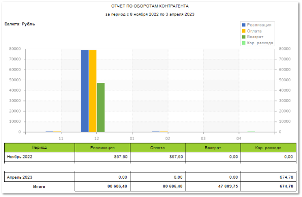

Отчет позволяет оценить обороты по контрагенту: сумму покупок, оплат и возвратов. По умолчанию отчет строится за последний год с помесячной группировкой показателей.

Отчет содержит:

- Период, а также наименование **Контрагента** по которому сформирован отчет, в соответствии с выбранными в параметрах;

- Информацию о **Валюте**, в которой сформирован отчет;

- График, на котором отображаются столбцы с **Реализациями**, **Оплатами**, **Возвратами**, **Кор.расхода** по датам, в соотношении с суммами соответствующих документов;

- **Табличную часть**, которая включает в себя следующую информацию:

    - **Период** – период операций (**Реализации**, **Оплаты**, **Возврата**, **Кор.расхода**). Период выставляется в соответствии с заданной настройкой **Период группировки** (день, неделя, месяц, год) в параметрах настройки отчета. Общий период группировки, заданный с помощью настройки Начальная и Конечная дата будет разбит по дням/ неделям/ месяцам/ годам в зависимости от выбранного в настройке **Период группировки**;

    - **Реализация** – сумма реализаций по заданному **Контрагенту**, в соответствии с выбранным **Периодом группировки**;

    - **Оплата** – сумма полученных оплат по заданному **Контрагенту**, в соответствии с выбранным **Периодом группировки**;

    - **Возврат** – сумма возвратов по документу **Возврат от клиента** по заданному Контрагенту, в соответствии с выбранным **Периодом группировки**;

    - **Кор.расхода** – сумма корректировок по корректировочным документам по заданному Контрагенту, в соответствии с выбранным **Периодом группировки**;

    - **Итого** – общие суммы по **Реализациям**, **Оплатам**, **Возвратам**, **Кор.расходов** в соответствии с периодом, заданным **Начальной** и **Конечной датой** формирования отчета.

::: details Читайте также

- [Документы Возвраты от клиентов](../../../specification/prodazhi/vozvraty_ot_klientov/vozvraty_ot_klientov.md)

- [Формирование корректировки расходной накладной](../../zakazy/formirovanie_korrektirovki_raskhodnoj_nakladnoj.md) 

:::