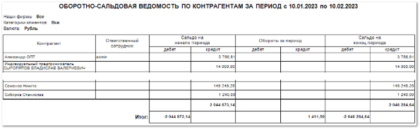

Отчет отражает сальдо на начало и конец выбранного периода, а также обороты за этот период для каждого контрагента.

При этом в бланке **Оборотно-сальдовая ведомость по контрагентам** доступна возможность детализировать обороты по контрагенту. Для этого необходимо открыть бланк на просмотр и один раз нажать левой кнопкой мыши на ячейку колонки **Обороты за период**. Тем самым откроется вкладка с детализацией оборотов, т.е. документов по контрагенту.

Отчет содержит:

- Период, за который сформирован отчет, а также информацию с параметрами отчета: **Наши фирмы**, **Категории клиентов**, **Валюта**, в соответствии с выбранными в параметрах формирования отчета;

- **Табличную часть**, которая включает в себя следующую информацию:

    - **Контрагент** – наименование контрагента с которым велись расчеты в разрезе заданного периода;

    - **Ответственный сотрудник** – ответственный за контрагента менеджер. Значение подставляется из карточки **Контрагента**;

    - **Сальдо на начало периода** – включает в себя информацию о дебете и кредите на начало заданного периода;

    - **Обороты за период** – включает в себя информацию о дебите и кредите по операциям в заданном периоде;

    - **Сальдо на конец периода** – включает в себя информацию о дебете и кредите на конец заданного периода;

    ::: info Примечание

    **Дебет** – сумма денежных средств, поступивших на счет **Нашей фирмы**.
    
    **Кредит** – сумма задолженности Нашей фирмы перед **Контрагентом**. 

    :::

    - **Итого** – суммы дебета и кредита по всем контрагентам для **Сальдо на начало периода**, **Оборотов за период**, **Сальдо на конец периода** в заданном временном промежутке.