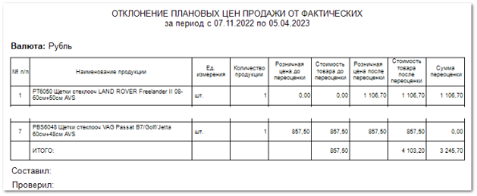

Отчет позволяет просмотреть цены на товар до и после переоценки.

Отчет содержит:

- Период, за который сформирован отчет, в соответствии с выбранными в параметрах;

- Информацию о **Валюте**, в которой сформирован отчет;

- **Табличную часть**, которая включает в себя следующую информацию:

    - **№ п/п** – порядковый номер записи в таблице;

    - **Наименование продукции** – артикул, наименование производителя и название товара по которому была произведена переоценка;

    - **Ед. измерения** – единица измерения товара;

    - **Количество продукции** – количество продукции из **Заказа клиента**/ **Расходной накладной**, по которой была проведена корректировка стоимости;

    - **Розничная цена до переоценки** – стоимость продажи товара до проведения переоценки по товару вручную;

    - **Стоимость товара до переоценки** – стоимость продажи товара до проведения переоценки по товару вручную, с учетом **Количества продукции** в **Заказе клиента**/**Расходной накладной**;

    ::: info Примечание

    Стоимость продажи товара до проведения переоценки выводится из существующих **Маркетингов** для прайс-листов.

    :::

    - **Розничная цена после переоценки** – стоимость продажи товара после проведения переоценки по данному товару вручную;

    - **Стоимость товара после переоценки** – стоимость продажи товара после проведения переоценки по данному товару вручную, с учетом **Количества** продукции в **Заказе клиента**/ **Расходной накладной**;

    - **Сумма переоценки** – разница между **Стоимостью товара после переоценки** и **Стоимостью товара до переоценки**;

    - **Итого** – суммы переоценок для значений: **Стоимость товара до переоценки**, **Стоимость товара после переоценки**, **Суммы переоценки** в разрезе заданного периода.

::: details Читайте также

- [Настройка ценообразования для прайс-листов](../../tsenoobrazovanie/README.md) 

:::