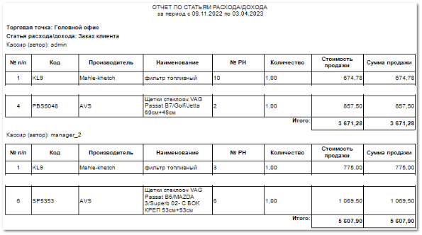

Отчет выводит список позиций из проведенных документов **Расходная накладная**, которые были хотя бы частично оплачены.

Отчет содержит:

- Период, за который сформирован отчет, а также информацию с параметрами отчета: **Торговая точка**, **Статья расхода/ дохода**, **Кассир (автор)**, в соответствии с выбранными в параметрах формирования отчета;

::: info Примечание

В случае, если параметры для формирования отчета не заданы, группировка позиций будет осуществляться сначала по **Торговой точке**, затем по **Статье расхода/дохода,** которая указана в платеже для документа, а затем по **Кассиру (автору)** документа **Расходная накладная.** Для всех **Расходных накладных**, по которым была произведена оплата (или частичная оплата) в заданном периоде.

:::

- **Табличную часть**, которая включает в себя следующую информацию:

    - **№ п/п** – порядковый номер записи в таблице;

    - **Код** – артикул товара из **Расходной накладной**;

    - **Производитель** – название производителя товара из **Расходной накладной**;

    - **Наименование** – название товара из **Расходной накладной**;

    - **№ РН** – номер документа **Расходная накладная**;

    - **Количество** -– количество товара, включенного в **Расходную накладную**;

    - **Стоимость продажи** – стоимость за единицу товара;

    - **Сумма продажи** – сумма, по которой весь товар продан клиенту;

    - **Итого** – итоговые значения **Стоимости** и **Суммы продажи** для перечня документов **Расходная накладная**.

::: info Примечание

Итоговые значения **Стоимости** и **Суммы продаж** по **Расходным накладным** суммируются по принципу группировки. Складываются суммы и стоимости накладных с одинаковыми значениями: **Торговая точка**, **Статья расхода/ дохода**, **Кассир (автор)**.

:::