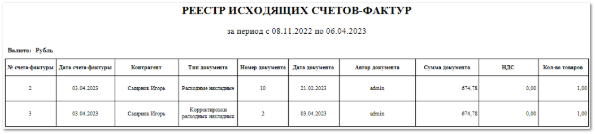

Отчет выводит все выставленные Вами счета-фактуры за указанный период по выбранным контрагентам с информацией о созданных корректировочных документах по выставленным счетам-фактурам.

Отчет содержит:

- Период, за который сформирован отчет, в соответствии с выбранными в параметрах;

- Информацию о **Валюте**, в которой сформирован отчет;

- **Табличную часть**, которая включает в себя следующую информацию:

    - **№ счета-фактуры** – порядковый номер счета-фактуры;

    - **Дата счета-фактуры** – дата документа счета-фактуры;

    - **Контрагент** – наименование контрагента по которому проводилась операция (**Расходная накладная**, **Корректировка расходной накладной**, **Заказ-наряд**);

    ::: info Примечание

    В отчете отражаются расходные документы, в которых было заполнено поле **Номер счета-фактуры** и **Дата счета-фактуры**.

    :::
    - **Тип документа** – тип созданного корректировочного документа на основании существующего счета-фактуры (**Расходная накладная**, **Корректировка расходной накладной**, **Заказ-наряд**);

    - **Номер документа** – порядковый номер созданного документа: **Расходной накладной**, **Корректировка расходной накладной**, **Заказ-наряда**;

    - **Дата документа** – значение поля Дата из документов **Расходная накладная** и **Корректировка расходной накладной**, значение поля **Дата начала работ** из документа **Заказ-наряд**;

    - **Автор документа** – пользователь, сформировавший расходный документ;

    - **Сумма документа** – значение суммы из расходного документа;

    - **НДС** – сумма НДС из расходного документа;

    - **Количество товаров** – количество товара по которому были произведены корректировки в созданном документе.

::: details Читайте также

- [Расходные накладные](../../../specification/prodazhi/rashodnye_nakladnye/rashodnye_nakladnye.md)

- [Корректировки расходных накладных](../../../specification/prodazhi/korrektirovki_rashodnyh_nakladnyh/korrektirovki_rashodnyh_nakladnyh.md)

- [Заказ-наряды](../../../specification/avtoservis/zakaz-naryady.md) 

:::

