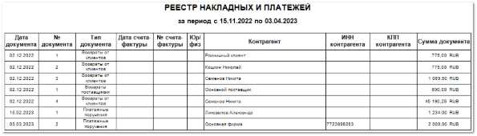

Отчет отображает информацию по выбранным видам документов за период с указанием реквизитов клиента и счетов-фактур.

Отчет содержит:

- Период, за который сформирован отчет, в соответствии с выбранными в параметрах;

- **Табличную часть**, которая включает в себя следующую информацию:

    - **Дата документа** – дата документа (**Приходная накладная**, **Расходная накладная**, **корректировочные документы**);

    - **№ документа** – порядковый номер созданного документа;

    - **Тип документа** – тип созданного документа;

    - **Дата счета-фактуры** – дата документа счета-фактуры;

    - **№ счета-фактуры** – порядковый номер счета-фактуры для корректировочных документов;

    - **Юр/ физ** – значение правового статуса контрагента. Значение подставляется из карточки **Контрагента**;

    - **Контрагент** – наименование контрагента по которому проводилась операция;

    - **ИНН контрагента** – номер ИНН контрагента. Значение подставляется из карточки **Контрагента**;

    - **КПП контрагента** – номер КПП контрагента. Значение подставляется из карточки **Контрагента**;

    - **Сумма документа** – значение суммы по документу.