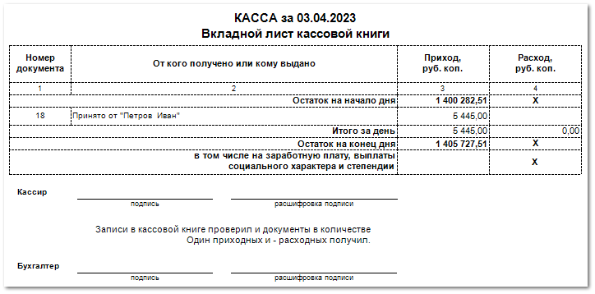
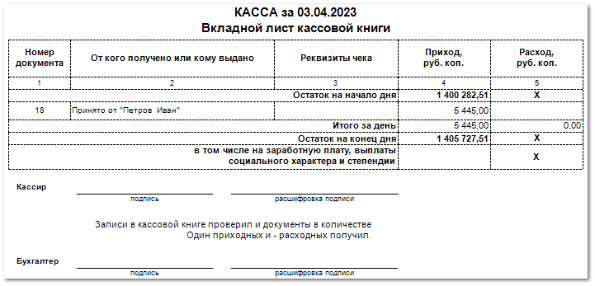

# Ежедневный отчет по кассе
Отчет отражает движение денежных средств по выбранному **Счету/кассе** за определенный день.

Из отчета **Ежедневный отчет по кассе** возможно формирование отчетов:

- **Отчет по кассе**;

- **Отчет по кассе с реквизитами чеков**;

В отчете содержится:

- **Номер документа** – порядковый номер документа;

- **От кого получено или кому выдано** – получатель/ плательщик из платежного документа, по которому был сформирован чек;

- **Реквизиты чека** – реквизиты напечатанного чека. Колонка отображается в **Отчете по кассе с реквизитами чеков**;

- **Приход, руб коп.** – сумма прихода по документу;

- **Расход, руб. коп.** – сумма расхода по документу;

- **Остаток на начало дня** и **Остаток на конец дня** – суммы в кассе на начало и конец дня с учетом всех проведенных операций;

- **Итого за день** – итоговые сумы **Прихода**, руб.коп и **Расхода**, руб.коп. по всем проведенным операциям;

- Место для подписей кассира и бухгалтера.