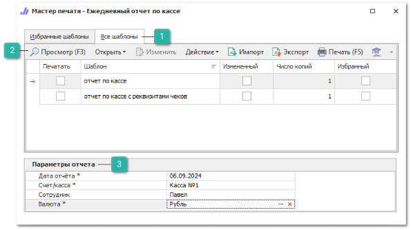
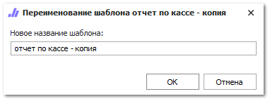

Чтобы сформировать **Отчеты по кассе**, выполните следующие действия:

**»** Откройте раздел **Отчеты и анализ ► Отчеты по кассе**.

**»** Выберите требуемый вариант отчета.

 **Все шаблоны**

Список доступных шаблонов отчета, позволяет выбрать необходимый для формирования отчет, а так же добавить шаблона в избранные.

 **Панель действий**

Панель состоит из следующих команд:

- **Просмотр (F3)** – позволяет открыть печатную форму для просмотра перед печатью;

- **Открыть** – позволяет открыть документ в выбранном формате. Содержит выпадающий список со следующими командами:

    - **В Word** – позволяет открыть документ в формате **\*.docx**;

    - **В Excel** – позволяет открыть документ в формате **\*.xlsx**;

    - **В PDF** – позволяет открыть документ в формате **\*.pdf**.

- **Изменить** – позволяет открыть редактор шаблонов для внесения изменений;

::: note Замечание

Команда недоступна при редактировании стандартных шаблонов. Редактирование доступно только для шаблонов, которые были скопированы (команда **Действие** ► **Копировать**) или импортированы (команда **Импорт**).

:::

- **Действие** – содержит выпадающий список команд для взаимодействия с шаблоном:

    - **Удалить** – удаляет выбранный шаблон. Команда доступна при выборе только измененных шаблонов;

    - **Копировать** – копирует выбранный шаблон. При нажатии на команду производится открытие окна с вводом наименования нового шаблона;

    - **Переименовать** – позволяет открыть окно для изменения наименования шаблона. Команда доступна только для шаблонов, которые не являются стандартными.

::: note Замечание

Сохранение шаблона недоступно, если: 

- название содержит спец. символы "\",  "/",  ":",  "\*",  "?",  """, "<",  ">",  "|"; 

- название не указано; 

- название и тип шаблона совпадают с уже имеющимся в базе данных.

:::

- **Импорт** – позволяет загрузить файл с шаблоном в расширении \*.mrt;

- **Экспорт** – позволяет выгрузить выделенный в табличной части шаблон, в файл с расширением \*.mrt;

- **Печать (F5)** – позволяет распечатать выбранные шаблоны;

- **Помощь** – позволяет открыть руководство пользователя на странице описания формы мастера печати.

 **Параметры отчета**

Позволяет задать необходимые параметры, наборы параметров отличаются в зависимости от выбранного отчета:

- **Начальная дата/Конечная дата** – даты начала и окончания формирования отчета;

- **Сотрудник**/ **Пользователи** – выбор пользователей, выполнивших действие **Печать чека**, по которым будет сформирован отчет. Доступен выбор одного или нескольких пользователей.

- **Валюта** – выбор валюты для конвертации сумм в отчете с учетом действующего курса валюты. Параметр обязателен для заполнения. Доступен выбор только одной валюты;

- **Счет/касса** – выбор счета/ кассы на которые зачислялись/ списывались денежные средства. Для выбора доступны счета и кассы из раздела **Финансы** **► Счета и кассы**;

- **Наша фирма** – выбор фирмы, по документам которой были напечатаны чеки. Доступен выбор одной или нескольких фирм;

- **Торговая точка** – значение торговой точки, по документам которой были напечатаны чеки. Доступен выбор одной или нескольких торговых точек;

- **СНО** – выбор системы налогообложения по которой были напечатаны чеки. Доступные для выбора значения: **СНО из ККТ**, **ОСН**, **УСН доход**, **УСН доход – расход**, **ЕСН**, **ПСН**, **Выбрать все**;

- **Тип оплаты** – выбор типа оплаты по которому были напечатаны чеки. Доступные для выбора значения: **Наличными**, **Безналичными**, **Банковской картой**, **В зачет аванса**, **Иная форма оплаты**, **Выбрать все**.

**»** Выберете шаблон, на основе которого нужно сформировать отчет.

**»** В блоке **Параметры отчета** задайте необходимые параметры.

**»** Откройте отчет в необходимой программе или распечатайте его.

::: details Читайте также

- [Справочник Счета и кассы](../../../specification/finansy/scheta_i_kassy.md) 

:::