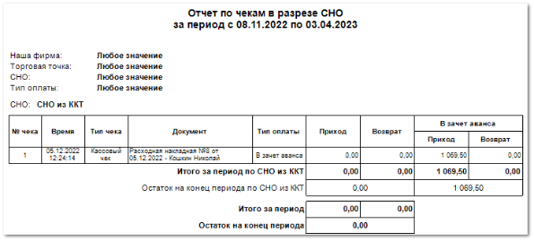

# Отчет по журналу учета чеков
Отчет строится на основании информации из **Журнала учета чеков** и позволяет просматривать информацию о напечатанных чеках в разрезе системы налогообложения.

Отчет по журналу учета чеков содержит:

- Период, за который сформирован отчет, **Наша фирма**, **Торговая точка**, **СНО**, **Тип оплаты**, в соответствии с выбранными в параметрах;

- **Табличную часть**, которая включает в себя следующую информацию:

    - **№ чека** – порядковый номер, напечатанного чека;

    - **Время** – время печати чека;

    - **Тип чека** – тип напечатанного чека;

    - **Документ** – документ по которому был напечатан чек;

    - **Тип оплаты** – тип оплаты по которому был напечатан чек. Возможные значения аналогичны **Типам оплаты**, которые выставляются в **Параметрах отчета** (см.выше);

    - **Приход** – сумма поступивших в зачет аванса денежных средств (заполняется для расходных документов);

    - **Возврат** – сумма возврата по документу (заполняется для возвратных документов);

    - **В зачет аванса** – суммы **Прихода**/ **Возврата**, зачисленные/ списанные предварительно (в зачет аванса).

::: details Читайте также

- [Журнал учета чеков](../../../specification/finansy/zhurnal_ucheta_chekov.md) 

:::