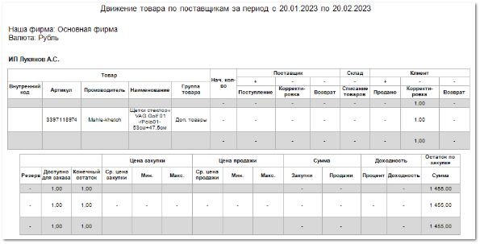

Отчет **Движение товара по поставщикам** отображает данные о движении товаров поставщиков от момента закупки до момента продажи за выбранный период.

Отчет содержит:

- Период, за который сформирован отчет, в соответствии с выбранным в параметрах периодом времени;

- Название фирмы, по товару которой сформирован отчет;

- Валюту операций отчета;

    - **Табличную часть**, отдельную для каждого поставщика, которая включает в себя следующую информацию:

    - **Товар**:

        - **Внутренний код** – идентификатор товара, используемый внутри системы;

        - **Артикул** – общепринятый идентификатор товара;

        - **Производитель** – производитель товара;

        - **Наименование** – название товара;

        - **Группа товара** – категория, присвоенная товару в системе;

    - **Нач кол-во** – количество товара в наличии на начальную дату формирования отчета;

    - **Поставщик**:

        - **Поступление** – количество поступивших позиций в рамках приходных накладных;

        - **Корректировка** – количество позиций, по которым сформированы корректировки приходных накладных;

        - **Возврат** – количество позиций, возвращенных поставщику согласно возвратам поставщику;

    - **Склад**:

        - **Списание товаров** – количество списанного товара;

    - **Клиент**:

        - **Продано** – количество позиций, отгруженных клиенту согласно расходным накладным;

        - **Корректировка** – количество позиций, по которым сформированы корректировки расходных накладных;

        - **Возврат** – количество позиций, возвращенных клиентами согласно возвратам клиента;

    - **Резерв** – количество позиций, зарезервированных для клиентов. В резерв попадают оприходованные позиции, которые были заказаны поставщику на основании **Заказа клиента**. Также в резерв попадают позиции, на которые был оформлен документ **Резервирования** из наличия;

    - **Доступно для заказа** – количество нигде не задействованных позиций, которые можно продать. Рассчитывается по формуле: *Поступление – Корректировка (Поставщик) – Возврат (Поставщик) – Продано – Списание товаров + Корректировка (Клиент) + Возврат (Клиент) – Резерв*;

    - **Конечный остаток** – количество оставшихся в наличии позиций включая резерв. Рассчитывается аналогично **Доступно для заказа**, без вычета резерва;

    - **Цена закупки:** 

        - **Ср.цена закупки** – средняя цена одной позиции, закупленной у поставщика в рамках указанного периода;

        - **Мин.** – наименьшая цена, по которой была закуплена позиция у поставщика в рамках указанного периода;

        - **Макс.** – наибольшая цена, по которой была закуплена позиция у поставщика в рамках указанного периода;

    - **Цена продажи** :

        - **Ср.цена продажи** – средняя цена одной позиции, проданной клиенту в рамках указанного периода;

        - **Мин.** – наименьшая цена, по которой позиция была продана клиенту в рамках указанного периода;

        - **Макс.** – наибольшая цена, по которой позиция была продана клиенту в рамках указанного периода;

    ::: info Примечание

    При расчете цен не учитываются товары из документа **Списание товаров**.

    :::
    
    - **Сумма** :

        - **Закупки** – сумма, которую фирма потратила на покупку позиций у поставщика;

        - **Продажи** – сумма, которую фирма получила при продаже позиций клиенту;

    - **Доходность** :

        - **Процент** – объем дохода продаж, выраженный в процентах (отношение суммы продаж к сумме закупки);

        - **Доходность** – объем дохода продаж, выраженный в валюте отчета (разность суммы продаж и суммы закупки). Если сумма закупки больше суммы продаж, значит доход отсутствует и в поле будет выведено "-";

    - **Остаток по закупке/Сумма** – сумма, на которую можно продать оставшийся в наличии товар. Рассчитывается как произведение **Конечного остатка** на **Ср.цену закупки**;

    - Блок итоговой информации содержит суммарные показатели по данным отчета. По колонке **Доходность Процент** рассчитывается среднее значение.

::: details Читайте также

- [Документы Приходные накладные](../../../../specification/sklad_i_zakupki/prihodnye_nakladnye.md)

- [Корректировки приходных накладных](../../../../specification/sklad_i_zakupki/korrektirovki_prihodnyh_nakladnyh.md)

- [Документы Возвраты поставщикам](../../../../specification/sklad_i_zakupki/vozvraty_postavschikam.md)

- [Документы Расходные накладные](../../../../specification/prodazhi/rashodnye_nakladnye/rashodnye_nakladnye.md)

- [Корректировки расходных накладных](../../../../specification/prodazhi/korrektirovki_rashodnyh_nakladnyh/korrektirovki_rashodnyh_nakladnyh.md)

- [Документы Возвраты от клиентов](../../../../specification/prodazhi/vozvraty_ot_klientov/vozvraty_ot_klientov.md)

- [Документы Заказы клиентов](../../../../specification/crm/zakazy_klientov.md)

- [Документы Резервирования](../../../../specification/crm/rezervirovanija.md) 

:::