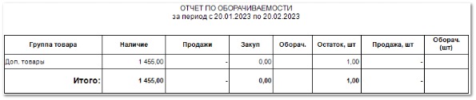

**Отчет по оборачиваемости**  отображает данные об эффективности продаж групп товаров за выбранный период.

Отчет содержит:

- Период, за который сформирован отчет, в соответствии с выбранными в параметрах;

- **Табличную часть** , которая включает в себя следующую информацию:

    - **Группа товара**  – наименования групп, по которым распределены товары;

    - **Наличие**  – сумма в валюте отчета, на которую может быть продан товар из наличия соответствующей группы. Рассчитывается как произведение **Конечного остатка** на **Ср.цену закупки**;

    - **Продажи**  – сумма в валюте отчета, на которую продан товар из соответствующей группы;

    - **Закуп**  – сумма в валюте отчета, на которую был закуплен товар из соответствующей группы;

    - **Оборач.**  – коэффициент, показывающий отношение суммы, на которую может быть продано оставшееся наличие к разнице суммы продаж и возвратов. Результат деления **Наличия** на **Продажи**;

    - **Остаток, шт**  – количество товара в наличии;

    - **Продажа, шт**  – количество товара, проданного из соответствующей группы;

    - **Оборач (шт)**  – коэффициент, показывающий отношение количества оставшегося в наличии товара к количеству проданного товара. Результат деления **Остатка,шт** на **Продажи,шт**;

- Блок **Итого** – общие показатели по движению товара.

::: info Примечание

Итоговые значения рассчитываются как сумма значений столбца. Значения **Оборачиваемости** и **Оборачиваемости, шт** рассчитываются на основе полученных итоговых значений **Наличия**, **Продаж**, **Остатка,шт** и **Продажи,шт** соответственно.

:::