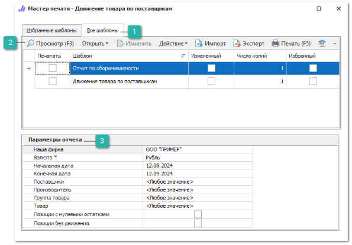
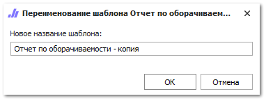

Чтобы сформировать **Отчет по поставщикам**, выполните следующие действия:

**»** Откройте раздел **Отчеты и анализ ► Отчеты по поставщикам**.

**»** Выберите требуемый вариант отчета.

 **Все шаблоны**

Список доступных шаблонов отчета, позволяет выбрать необходимый для формирования отчет, а так же добавить шаблона в избранные.

 **Панель действий**

Панель состоит из следующих команд:

- **Просмотр (F3)** –  позволяет открыть печатную форму для просмотра перед печатью;

- **Открыть** –  позволяет открыть документ в выбранном формате. Содержит выпадающий список со следующими командами:

    - **В Word** –  позволяет открыть документ в формате **\*.docx**;

    - **В Excel** –  позволяет открыть документ в формате **\*.xlsx**;

    - **В PDF** –  позволяет открыть документ в формате **\*.pdf**.

- **Изменить** –  позволяет открыть редактор шаблонов для внесения изменений;

::: note Замечание

Команда недоступна при редактировании стандартных шаблонов. Редактирование доступно только для шаблонов, которые были скопированы (команда **Действие** ► **Копировать**) или импортированы (команда **Импорт**).

:::

- **Действие** –  содержит выпадающий список команд для взаимодействия с шаблоном:

    - **Удалить** –  удаляет выбранный шаблон. Команда доступна при выборе только измененных шаблонов;

    - **Копировать** –  копирует выбранный шаблон. При нажатии на команду производится открытие окна с вводом наименования нового шаблона;

    - **Переименовать** –  позволяет открыть окно для изменения наименования шаблона. Команда доступна только для шаблонов, которые не являются стандартными.

::: note Замечание

Сохранение шаблона недоступно, если: 

- название содержит спец. символы "\",  "/",  ":",  "\*",  "?",  """, "<",  ">",  "|"; 

- название не указано; 

- название и тип шаблона совпадают с уже имеющимся в базе данных.

:::

- **Импорт** –  позволяет загрузить файл с шаблоном в расширении \*.mrt;

- **Экспорт** –  позволяет выгрузить выделенный в табличной части шаблон, в файл с расширением \*.mrt;

- **Печать (F5)** –  позволяет распечатать выбранные шаблоны;

- **Помощь** –  позволяет открыть руководство пользователя на странице описания формы мастера печати.

 **Параметры отчета**

Позволяет задать необходимые параметры, наборы параметров отличаются в зависимости от выбранного отчета:

- **Наша фирма** – выбор фирмы, документы которой попадут в отчет. Доступен выбор только одной фирмы;

- **Валюта \*** – выбор валюты для конвертации сумм в отчете с учетом действующего курса валюты. Параметр обязателен для заполнения. Доступен выбор только одной валюты;

- **Начальная дата** – дата начала формирования отчета;

- **Конечная дата** – дата окончания формирования отчета;

- **Поставщики** – выбор поставщиков, позиции которых попадут в отчет. Доступен выбор нескольких поставщиков;

- **Производитель** – выбор производителя для формирования отчета. При формировании отчета будут учтены синонимы. Доступен выбор только одного производителя;

- **Группа товара** – выбор группы товаров, по которой будет формироваться отчет. Доступен выбор только одной группы;

- **Товар** – выбор конкретного товара для формирования отчета. Доступен выбор только одного товара;

- **Позиции с нулевыми остатками** – в отчет попадут позиции, остатки по которым на начало и конец периода равны нулю;

- **Позиции без движения** – в отчет попадут позиции, по которым не совершался приход/расход за выбранный период;

- **Склад/Торговая точка** – выбор складов, по которым будет формироваться отчет. Доступен выбор одного или нескольких складов в зависимости от выбранного отчета;

- **Пользователь(Менеджер)/Пользователь(Продавец)** – выбор пользователей, по которым должен быть сформирован отчет. Доступен выбор одного или нескольких пользователей в зависимости от выбранного отчета;

- **Контрагент** – выбор клиента, по которому формируется отчет. Доступен выбор одного или нескольких клиентов;

- **Категория клиента** – выбор категорий клиента, по которой будет формироваться отчет. Доступен выбор одной или нескольких категорий в зависимости от выбранного отчета.

**»** Выберите шаблон, на основе которого нужно сформировать отчет.

**»** В блоке **Параметры отчета** задайте необходимые параметры.

**»** Откройте отчет в необходимой программе или распечатайте его.

::: details Читайте также

- [Отчеты по поставщикам](../../../specification/otchety_i_analiz/otchety_po_postavshchikam/otchet_po_postavshchiku.md) 

:::