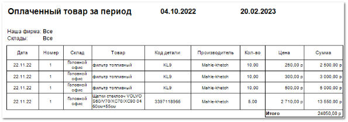

Отчет **Оплаченный товар за период** отображает данные о проведенных операциях оплаты оприходованного товара за выбранный период.

Отчет содержит:

- Период, за который сформирован отчет, в соответствии с выбранными в параметрах;

- Название фирмы, по которой сформирован отчет;

- Склады, на которые был принят или с которых был списан товар;

- **Табличную часть** , которая включает в себя следующую информацию:

    - **Дата** – дата проведения прихода;

    - **Номер** – номер приходной накладной;

    - **Склад** – на который был оприходован товар;

    - **Товар** – название товара, с которым проведена операция;

    - **Код детали** – артикул товара, с которым проведена операция;

    - **Производитель** – название производителя товара;

    - **Кол-во** – количество товара с одинаковым артикулом и ценой, по которому проведена операция;

    - **Цена** – сумма за проведение операции по одной единице товара;

    - **Сумма** – сумма за проведение операции по товару с указанным количеством;

    - **Итого** – общая сумма проведенных операций.