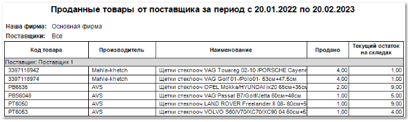

**Отчет о расходе от поставщика**  отображает данные об объеме продаж позиций, заказанных поставщику за выбранный период.

Отчет содержит:

- Период, за который сформирован отче, в соответствии с выбранными в параметрах;

- Название поставщиков, по которому сформирован отчет;

- **Табличную часть** , разделенную по поставщикам, которая включает в себя следующую информацию:

    - **Код товара** – артикул проданного товара;

    - **Производитель** – название производителя проданного товара;

    - **Наименование** – название проданной позиции;

    - **Продано** – количество проданных позиций с одинаковым артикулом и производителем;

    - **Текущий остаток на складах** – количество позиций с одинаковым артикулом и производителем, которое осталось в наличии.