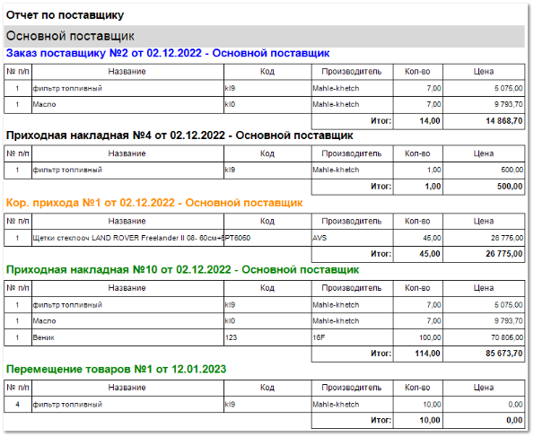

**Отчет по поставщику**  содержит данные о действиях, произведенных по позициям поставщика, за выбранный период.

Отчет содержит:

- Название поставщика, по которому сформированы таблицы;

- Название, дата проведения документа и номер операции по позициям поставщика;

- **Табличную часть**  для каждого действия, которая включает в себя следующую информацию:

    - **№ п/п** – порядковый номер записи в таблице;

    - **Название** – название позиции, по которой произведены действия;

    - **Код** – артикул товара, по которому произведены действия;

    - **Производитель** – название производителя товара, по которому произведены действия;

    - **Кол-во** – число позиций с одинаковым артикулом и производителем, по которым поставщик сформировал отказ;

    - **Цена** – стоимость одной позиции с указанным артикулом и производителем;

    - **Итог** – общее количество позиций и их стоимость в рамках каждой операции.