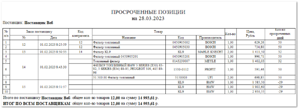

Отчет **Просроченные позиции** отображает данные о позициях в заказе поставщику, по которым нарушен срок поставки, за выбранный период.

Отчет содержит:

- Период, за который сформирован отчет, в соответствии с выбранными в параметрах;

- Название поставщика, по которому сформирована таблица;

- **Табличную часть**  для каждого поставщика, которая включает в себя следующую информацию:

    - **№ п/п**  – порядковый номер записи в таблице;

    - **Заказ поставщику** :

        - **№**  – номер заказа;

        - **Дата**  – дата формирования заказа;

    - **Код контрагента**  – порядковый номер контрагента из справочника контрагентов;

    - **Товар** :

        - **Название**  – название позиции, по которой просрочена поставка;

        - **Код**  – артикул товара, по которому просрочена поставка;

        - **Производитель**  – название производителя товара, по которому просрочена поставка;

    - **Кол-во**  – число позиций с одинаковым артикулом и производителем, по которым просрочена поставка;

    - **Цена, Рубль**  – стоимость одной позиции с указанным артикулом и производителем;

    - **Кол-во просроченных дней**  – количество дней, на которое задержана поставка;

- **Итого по поставщику**  – общее количество просроченных позиций по поставщику и их стоимость;

- **Итог по всем поставщикам**  – общее количество просроченных позиций и их стоимость по всем поставщикам.