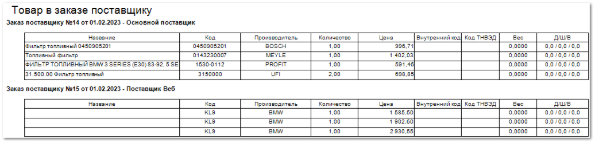
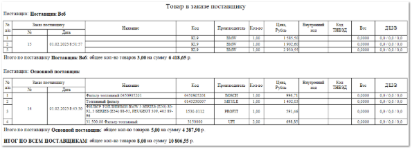

Отчет **Товар в заказе поставщику** отображает данные о позициях, заказанных поставщику за выбранный период.

Отчет содержит:

- Номер заказа поставщику для каждой табличной части;

- **Табличную часть**  для каждого заказа поставщику, которая включает в себя следующую информацию:

    - **Название** – название позиции, заказанной поставщику;

    - **Код** – артикул товара, заказанного поставщику;

    - **Производитель** – название производителя товара, заказанного поставщику;

    - **Количество** – число позиций с одинаковым артикулом и производителем, заказанных поставщику;

    - **Цена** – стоимость закупа одной позиции с указанным артикулом и производителем;

    - **Внутренний код** – код позиции, который используется внутри системы;

    - **Код ТНВЭД** – общепринятый код товарной номенклатуры внешнеэкономической деятельности, используемый при проведении таможенных операций;

    - **Вес** – вес позиции;

    - **Д/Ш/В** – длина, ширина и высота позиции.

Дополнительный печатный бланк **Товар в заказе поставщику (группировка по поставщику)** аналогичен шаблону **Товар в заказе поставщику**. Отличие состоит в том, что заказы здесь сгруппированы по поставщикам. 

Отчет дополнительно содержит:

- **№ п/п** – порядковый номер позиции в рамках сформированной таблицы;

- **Итого по поставщику** – общее количество заказанных позиций поставщику и их стоимость;

- **Итог по всем поставщикам** – общее количество заказанных позиций и их стоимость по всем поставщикам.