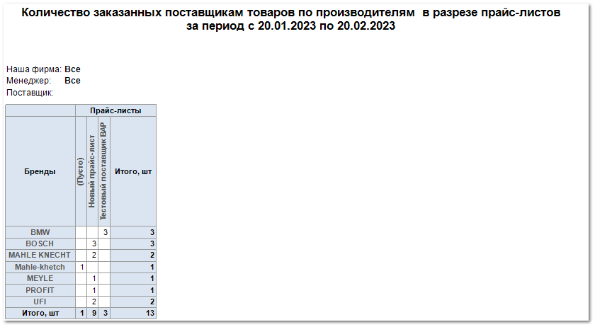
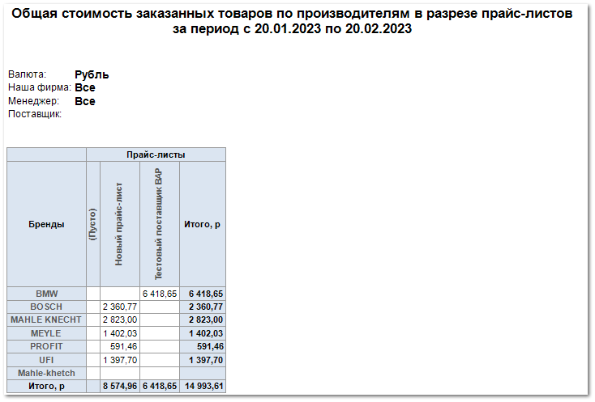

Отчет **Количество позиций по производителям** отображает данные об объеме позиций, которые были заказаны поставщикам, за выбранный период.

Отчет содержит:

- Период, за который сформирован отчет, в соответствии с выбранными в параметрах;

- Название фирмы, по товару которой сформирован отчет;

- Менеджера, по которому сформирован отчет;

- Поставщика, позиции которого попадут в отчет;

- **Табличную часть** , которая включает в себя следующую информацию:

    - **Бренды** – список производителей, по которым были заказы поставщикам;

    - **Прайс-листы** – список прайс-листов, из которых были заказы поставщикам;

    ::: note Замечание

    При добавлении позиции в заказ без маркетинга, например, из справочника товаров, он попадает в колонку **(Пусто)**.

    :::

    - Блок **Итого, шт**: – включает в себя общее количество заказанных позиций из конкретного прайс-листа, а также каждого производителя.

Также для данного отчета доступен дополнительный печатный бланк **Общая стоимость позиций по производителям** – поля **Итого, шт** заменены на **Итого, р**, которые включают в себя информацию о суммах по заказным позициям из конкретного прайс-листа, а также каждого производителя.

