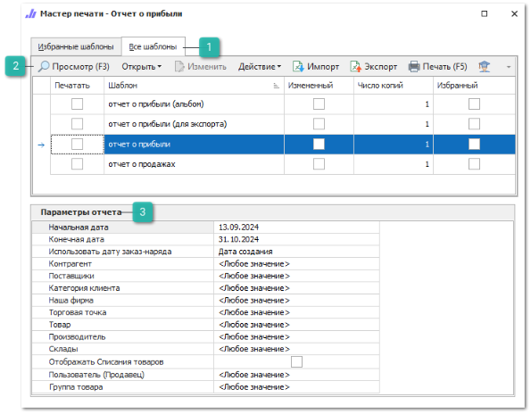
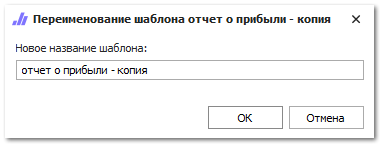

Чтобы сформировать **Отчеты по прибыли**, выполните следующие действия:

**»** Откройте раздел **Отчеты и анализ ► Отчеты по прибыли**.

**»** Выберите требуемый вариант отчета.

 **Все шаблоны**

Список доступных шаблонов отчета, позволяет выбрать необходимый для формирования отчет, а так же добавить шаблона в избранные.

 **Панель действий**

Панель состоит из следующих команд:

- **Просмотр (F3)** – позволяет открыть печатную форму для просмотра перед печатью;

- **Открыть** – позволяет открыть документ в выбранном формате. Содержит выпадающий список со следующими командами:

    - **В Word** – позволяет открыть документ в формате **\*.docx**;

    - **В Excel** – позволяет открыть документ в формате **\*.xlsx**;

    - **В PDF** – позволяет открыть документ в формате **\*.pdf**.

- **Изменить** – позволяет открыть редактор шаблонов для внесения изменений;

::: note Замечание

Команда недоступна при редактировании стандартных шаблонов. Редактирование доступно только для шаблонов, которые были скопированы (команда **Действие** ► **Копировать**) или импортированы (команда **Импорт**).

:::

- **Действие** – содержит выпадающий список команд для взаимодействия с шаблоном:

    - **Удалить** – удаляет выбранный шаблон. Команда доступна при выборе только измененных шаблонов;

    - **Копировать** – копирует выбранный шаблон. При нажатии на команду производится открытие окна с вводом наименования нового шаблона;

    - **Переименовать** – позволяет открыть окно для изменения наименования шаблона. Команда доступна только для шаблонов, которые не являются стандартными.

::: note Замечание

Сохранение шаблона недоступно, если:

- название содержит спец. символы "\",  "/",  ":",  "\*",  "?",  """, "<",  ">",  "|"; 

- название не указано; 

- название и тип шаблона совпадают с уже имеющимся в базе данных.

:::

- **Импорт** – позволяет загрузить файл с шаблоном в расширении \*.mrt;

- **Экспорт** – позволяет выгрузить выделенный в табличной части шаблон, в файл с расширением \*.mrt;

- **Печать (F5)** – позволяет распечатать выбранные шаблоны;

- **Помощь** – позволяет открыть руководство пользователя на странице описания формы мастера печати.

 **Параметры отчета**

Позволяет задать необходимые параметры, наборы параметров отличаются в зависимости от выбранного отчета:

- **Использовать дату заказ-наряда** – дата из параметров документа **Заказ-Наряд**, используемая при построении отчета. Доступны для выбора значения: дата создания, дата начала работ, дата завершения работ, дата закрытия. В отчет попадут документы только по выбранной дате, входящей в заданный диапазон. При выборке документов учитывается дата, которая указана в параметрах документа на момент формирования отчета;

- **Контрагент**/**Клиент** – выбор клиента, по которому формируется отчет. Доступен выбор только одного контрагента/клиента;

- **Поставщики** – выбор поставщиков, позиции которых попадут в отчет. Доступен выбор нескольких поставщиков;

- **Категория клиента** – выбор категорий клиента, по которой будет формироваться отчет. Доступен выбор одной или нескольких категорий в зависимости от выбранного отчета;

- **Наша фирма** – выбор фирм, документы которых попадут в отчет. Доступен выбор одной или нескольких фирм в зависимости от выбранного отчета;

- **Торговая точка** – выбор торговой точки, по которой будет формироваться отчет. Возможен выбор только одной торговой точки;

- **Товар** – выбор конкретного товара для формирования отчета. Доступен выбор только одного товара;

- **Производитель** – выбор производителя для формирования отчета. При формировании отчета будут учтены синонимы. Доступен выбор только одного производителя;

- **Склад** – выбор складов, по которым будет формироваться отчет. Доступен выбор одного или нескольких складов в зависимости от выбранного отчета;

- **Отображать Списания товаров** – позволяет отобразить в отчетной форме позиции товаров документа **Списания товаров**;

- **Пользователь (Продавец)/Менеджеры (Пользователи)**/**Автор** – выбор пользователей, по которым должен быть сформирован отчет. Доступен выбор одного или нескольких пользователей в зависимости от выбранного отчета;

::: note Замечание

Среди пользователей (менеджеров), в случае функционирования интернет-магазина на **Parts.Resource**, присутствует пользователь с ролью **WebEngine**. При выборе в качестве документа-основания **Заказ клиента**, прибыль по заказам из интернет-магазина будет закреплена за данным системным пользователем.

:::

- **Группа(-ы) товара(-ов)** – выбор группы товаров, по которой будет формироваться отчет. Доступен выбор только одной группы;

::: note Замечание

Для **Отчёты по прибыли по менеджерам** доступен множественный выбор групп.

:::

- **Валюта\*** – выбор валюты для конвертации сумм в отчете с учетом действующего курса валюты. Параметр обязателен для заполнения. Доступен выбор только одной валюты;

- **Статус документа** – выбор статуса, находящиеся в котором документы должны попасть в отчет. Доступен выбор значений: все документы, только оплаченные, только неоплаченные;

::: note Замечание

Документ в отчете является оплаченным, если его долг равен 0 и платежи по этому документу попали в указанный в отчете период времени.

:::

- **Использовать менеджера, который** – выбор роли менеджера по отношению к документам, попавшим в отчет. Доступные роли:

    - **Ответственный менеджер** – устанавливается в поле **Ответственный менеджер** в карточке контрагента;

    - **Автор документа** – пользователь, сформировавший документ;

    - **Автор проводки документа** – пользователь, который выполнил проведение документа;

- **Документ-основание** – выбор документа, на основании которого будет распределяться прибыль между менеджерами. Доступны значения: заказ клиента, расходная накладная. Например, при выборе значения **Заказ клиента** прибыль будет распределена на менеджера, который провел заказ;

- **Признак оплаты документов** – выбор способа отбора документов по состоянию оплаты. Доступные значения:

    - **Не учитывать оплату** – оплата документа не будет влиять на его попадание в отчет;

    - **Только полностью оплаченные ЗН, РН, ВК** – в отчет попадут документы с нулевым долгом;

    - **Только полностью оплаченные ЗН, РН и ВК, связанные с оплаченными РН** – в отчет попадут ЗН и РН с нулевым долгом, а ВК отбираются только те, которые связаны с полностью оплаченными РН финансовыми документами. ВК в случае взаимозачета с РН в отчет не попадают.

::: note Замечание

При отборе документов по состоянию оплаты учитывается **Дата разнесения** документов оплаты. Если дата разнесения не соответствует выбранному периоду отчета, то документ не будет считаться оплаченным.

:::

**»** Выберете шаблон, на основе которого нужно сформировать отчет.

**»** В блоке **Параметры отчета** задайте необходимые параметры.

**»** Откройте отчет в необходимой программе или распечатайте его.

::: details Читайте также

- [Справочник Контрагенты](../../../specification/crm/klienty/README.md) 

:::