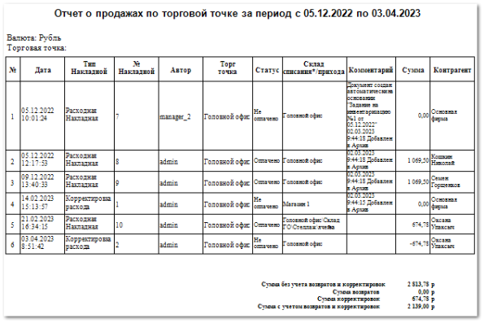

**Отчет о продажах по торговой точке** отображает данные о проведенных операциях, связанных с продажами за указанный период.

Отчет содержит:

- Период, за который сформирован отчет, в соответствии с выбранными в параметрах;

- Валюту операций отчета;

- Торговую точку, по которой сформирован отчет;

- **Табличную часть**, которая включает в себя следующую информацию:

    - **№** – общий порядковый номер операции;

    - **Дата** – дата и время проведения операции;

    - **Тип накладной** – название документа, на основании которого проведена операция;

    - **№ Накладной** – порядковый номер операции соответствующего типа;

    - **Автор** – пользователь, который провел операцию;

    - **Торг точка** – название торговой точки, на которой произошла операция;

    - **Статус** – состояние оплаты по операции;

    - **Склад списания\*/прихода** – название торговой точки/позиции на складе, на которой была предоставлена услуга/с которой был списан товар;

    - **Комментарий** – дополнительная информация о формировании документа (например, об автоматическом создании на основании другого документа);

    - **Сумма** – сумма, на которую проведена операция;

    - **Контрагент** – название клиента, в отношении которого проведена операция;

- Сумма продаж торговой точки без учета возвратов и корректировок;

- Сумма возвратов торговой точки;

- Сумма корректировок торговой точки;

- Сумма продаж торговой точки с учетом возвратов и корректировок.