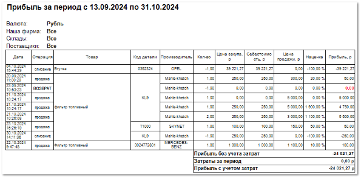
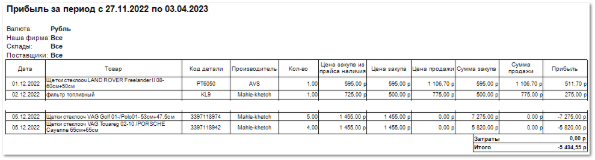
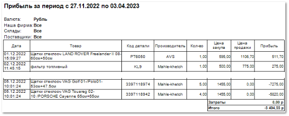
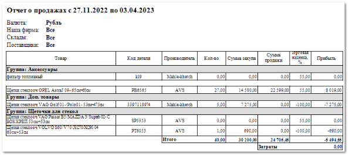

**Отчет о прибыли** отображает данные о проведенных операциях по товарам за выбранный период.

Отчет содержит:

- Период, за который сформирован отчет, в соответствии с выбранными в параметрах;

- Валюта операций отчета;

- Список фирм\торговых точек, по которым сформирован отчет;

- Склады, с которых был списан товар;

- Поставщики, по которым сформирован отчет;

- **Табличную часть**, которая включает в себя следующую информацию:

    - **Дата** – дата операции (продажи, возврата и т.д.);

    - **Операция** – название операции (продажа/возврат/кор.расхода/списание);

    ::: note Замечание

    Операции **Списание** отображаются в отчетной форме при установке **Отображать Списания товаров** в параметрах отчетной формы. Товары по таким операциям будут отображаться из проведенных документов раздела **Склад и закупки ► Списания товаров**.

    :::

    - **Товар** – название товара, с которым проведена операция;

    - **Код детали** – артикул товара, с которым проведена операция;

    - **Производитель** – название производителя товара;

    - **Кол-во** – количество участвующего товара в конкретной операции;

    - **Цена закупа** – сумма, переданная поставщику за товар;

    - **Себестоимость** – сумма, включающая в себя **Цену закупа**, **Прочие расходы** и **Стоимость доставки** (при включенной настройке **Включать стоимость доставки в себестоимость товара**) товара на торговую точку;

    ::: note Замечание

    **Прочие расходы** можно указать в **Приходной накладной** на соответствующей вкладке. **Стоимость доставки** можно настроить в разделе **Управление ► Справочники ► Стоимости доставок**. Также, для включения **Стоимости доставки** в **Себестоимость**, необходимо включить соответствующую опцию в меню **Управление ► Настройки программы ► Настройки**, группа **Товары и цены ►  Прайс-листы и ценообразование**. 

    :::

    - **Цена продажи** – сумма, по которой товар продан клиенту;

    - **Наценка** – процент, на который увеличится Себестоимость товара для **получения Цены продажи клиенту**;

    - **Прибыль** – сумма, которую фирма фактически получает после проведения операции (разница между **Ценой продажи** и **Себестоимостью**);

    - Блок **Итого**:

        - **Прибыль без учета затрат** – рассчитывается как разность значений **Сумма продаж** и **Сумма закупки**;

        - **Затраты за период** – рассчитываются исходя из документов, с указанными статьями;

        ::: note Замечание

        Статьи для расчета затрат задаются в пункте **Виды статей для расчета ЗАТРАТ** раздела **Управление ►** **Настройки программы** **► Наши фирмы** блока **Статьи**.

        :::

        - **Прибыль с учетом затрат** – рассчитывается как разность значений **Прибыль без учета затрат** и затраты за период.

Также для данного отчета доступны несколько дополнительных печатных бланков:

- **Отчет о прибыли (Альбом)**, который дополнительно содержит информацию:

    - **Цена закупа из прайса наличия** – цена закупа, указанная в прайс-листе наличия;

    - **Сумма закупа** – сумма, переданная поставщику за весь товар.

::: note Замечание

В шаблоне **Отчет о прибыли (Альбом)** отсутствуют колонки: **Операция, Себестоимость**, **Наценка**, а также блок итого **Прибыль без учета затрат**.

:::

- **Отчет о прибыли (для экспорта)**.

::: note Замечание

В шаблоне **Отчет о прибыли (для экспорта)** отсутствуют колонки: **Операция, Себестоимость**, **Наценка**, а также блок итого **Прибыль без учета затрат**.

:::

- **Отчет о продажах**, который дополнительно содержит информацию:

    - **Группы товаров**;

    - **Сумма закупа** – сумма, переданная поставщику за весь товар;

    - **Сумма продажи** – сумма, по которой весь товар продан клиенту;

    - Блок **Итого**: **Общее количество**, **Общая сумма закупа**, **Общая сумма продажи**, **Общая сумма прибыли**; **Общая сумма затрат**.

::: note Замечание

В шаблоне **Отчет о продажах** отсутствуют колонки: **Дата**, **Операция**, **Цена закупа**, **Себестоимость**, а также блок итого **Прибыль без учета затрат**.

:::

::: details Читайте также

- [Формирование отчетов](./formirovanie_otchetov.md)

- [Первичное оприходование остатков на склад](../../svoe_nalichie/oprikhodovanie_tovara/oprikhodovanie_ostatkov_na_sklad.md)

- [Справочник Стоимости доставок](../../../specification/upravlenie/spravochniki/stoimosti_dostavok.md)

- [Настройки программы - Настройки - Товары и цены - Прайс-листы и ценообразование](../../../specification/upravlenie/nastrojki_programmy/nastrojki/tovary_i_tseny/prajs-listy_i_tsenoobrazovanie.md)

- [Настройки программы - Наши фирмы](../../../specification/upravlenie/nastrojki_programmy/nashi_firmy.md) 

:::

