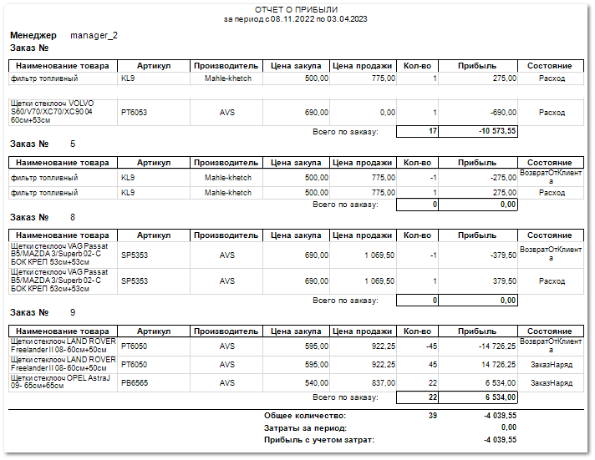
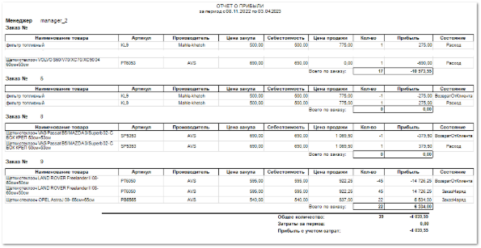

**Отчет о прибыли по менеджерам** отображает данные по заказам всех менеджеров за выбранный период.

Отчет содержит:

- Период, за который сформирован отчет, в соответствии с выбранными в параметрах;

- Имя менеджера, который оформлял заказ (при отсутствии имени будет указан логин пользователя, который оформлял заказ);

- Номер заказа для каждой отдельной табличной части;

- **Табличную часть** для каждого заказа менеджера, которая включает в себя следующую информацию:

    - **Наименование товара** – название товара, включенного в заказ;

    - **Артикул** – артикул товара, включенного в заказ;

    - **Производитель** – название производителя товара, включенного в заказ;

    - **Цена закупа** – сумма, переданная поставщику за товар;

    - **Цена продажи** – сумма, по которой товар продан клиенту;

    - **Кол-во** – количество товара, включенного в заказ;

    - **Прибыль** – сумма, которую фирма фактически получает после проведения операции (разница между **Ценой продажи** и **Себестоимостью**);

    - **Состояние** – документ, в котором списана позиция;

    - **Всего по заказу** – общее количество и общая прибыль;

- **Общее количество** – сумма позиций, а также сумма прибыли без учета затрат по всем заказам;

- **Затраты за период** – рассчитываются исходя из документов, с указанными статьями;

::: info Примечание

Статьи для расчета затрат задаются в пункте **Виды статей для расчета ЗАТРАТ** раздела **Управление ► Настройки программы ► Наши фирмы** блок **Статьи**.

:::

- **Прибыль с учетом затрат за период** – рассчитывается как разность значений **Прибыль без учета затрат** и **Затраты за период**.

Также для данного отчета доступен дополнительный шаблон **Отчет о прибыли по менеджерам (себестоимость)** – шаблон дополнительно содержит информацию о **Себестоимости** – сумма, включающая в себя **Цену закупа**, **Прочие расходы** и **Стоимость доставки** (при включенной настройке **Включать стоимость доставки в себестоимость товара** раздела  **Управление ► Настройки программы ► Настройки ► Прайс-листы и ценообразование**) товара на торговую точку.

::: details Читайте также

- [Настройки программы - Наши фирмы](../../../specification/upravlenie/nastrojki_programmy/nashi_firmy.md)

- [Настройки программы - Настройки - Товары и цены - Прайс-листы и ценообразование](../../../specification/upravlenie/nastrojki_programmy/nastrojki/tovary_i_tseny/prajs-listy_i_tsenoobrazovanie.md) 

:::