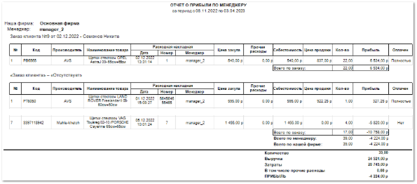

**Отчет о прибыли по менеджерам в разрезе расходных накладных** отображает данные о проведенных операциях, связанных с проведением расхода за указанный период.

Отчет содержит:

Период, за который сформирован отчет, в соответствии с выбранными в параметрах;

Название фирмы, по которой сформирован отчет;

Имя менеджера, по которому сформирован отчет;

Номер заказа для каждой отдельной табличной части;

- **Табличную часть** для каждого заказа менеджера, попавшего в указанный период, которая включает в себя следующую информацию:

    - **№** – общий порядковый номер операции;

    - **Код** – артикул товара, с которым проведена операция;

    - **Производитель** – название производителя товара, с которым проведена операция;

    - **Наименование товара** – название товара, с которым проведена операция;

    - **Расходная накладная** – дата проведения расходной накладной, время проведения расходной накладной, номер расходной накладной, менеджер, который провел расход;

    - **Цена закупа** – сумма, переданная поставщику за товар;

    - **Прочие расходы** – сумма дополнительных расходов, влияющих на себестоимость товара;

    ::: info Примечание

    - **Прочие расходы** можно указать в **Приходной накладной** на соответствующей вкладке.

    :::
    - **Себестоимость** – сумма, включающая в себя **Цену закупа**, **Прочие расходы** и **Стоимость доставки** товара на торговую точку;

    - **Цена продажи** – сумма, по которой товар продан клиенту;

    - **Кол-во** – количество товара, включенного в заказ;

    - **Прибыль** – сумма, которую фирма фактически получает после проведения операции (разница между Ценой продажи и Себестоимостью);

    - **Оплачен** – состояние оплаты заказа;

    ::: info Примечание

    В отчет попадают только состояния **Нет** или **Полностью.** Частично оплаченные заказы не попадают в отчет

    :::
    
    - **Всего по заказу** – содержит сумму позиций, а также сумму прибыли без учета затрат в рамках заказа;

- **Всего по менеджеру** – суммарное количество позиций и прибыль по менеджеру;

- **Всего по нашей фирме** – суммарное количество позиций и прибыль по фирме;

- **Количество** – общее количество позиций по всем заказам;

- **Выручка** – общая сумма выручки по всем заказам. Рассчитывается как сумма произведений **Цены продажи** позиций на их **Количество**;

- **Затраты** – общая сумма затрат по всем заказам;

::: info Примечание

Статьи для расчета затрат задаются в пункте **Виды статей для расчета ЗАТРАТ** раздела **Управление ►** **Настройки программы** **► Наши фирмы** блок **Статьи**.

:::

- **В том числе прочие расходы** – общая сумма прочих расходов, включенных в затраты;

::: info Примечание

**Прочие расходы** можно указать в **Приходной накладной** на соответствующей вкладке.

:::

- **Прибыль** – общая прибыль по всем заказам. Рассчитывается как разность значений **Выручки** и **Затрат** с учетом **Прочих расходов**.

::: details Читайте также

[Первичное оприходование остатков на склад](../../svoe_nalichie/oprikhodovanie_tovara/oprikhodovanie_ostatkov_na_sklad.md)

[Настройки программы - Наши фирмы](../../../specification/upravlenie/nastrojki_programmy/nashi_firmy.md) 

:::