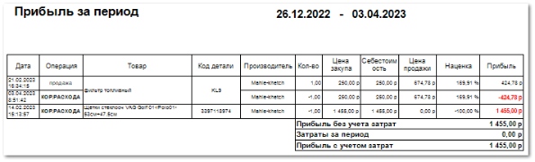

**Сколько заработано за день** отображает данные о проведенных операциях по товарам за выбранный период.

Отчет содержит:

- Период, за который сформирован отчет, в соответствии с выбранными в параметрах;

- **Табличную часть**, которая включает в себя следующую информацию;

    - **Дата** – дата совершения операции (продажи/возврата и т.д.);

    - **Операция** – название операции (продажа/возврат/кор.расхода);

    - **Товар** – название товара, с которым проведена операция;

    - **Код детали** – артикул товара, с которым проведена операция;

    - **Производитель** – название производителя товара;

    - **Кол-во** – количество участвующего товара в конкретной операции;

    - **Цена закупа** – сумма, переданная поставщику за товар;

    - **Себестоимость** – сумма, включающая в себя **Цену закупа**, **Прочие расходы** и **Стоимость доставки** (при включенной настройке **Включать стоимость доставки в себестоимость товара**) товара на торговую точку;

    ::: info Примечание

    **Прочие расходы** можно указать в **Приходной накладной** на соответствующей вкладке.

    :::

    ::: info Примечание

    **Стоимость доставки** можно настроить в разделе **Управление ► Справочники ► Стоимости доставок**. Также, для включения **Стоимости доставки** в **Себестоимость**, необходимо включить соответствующую опцию в меню **Управление ► Настройки программы ► Настройки**, группа **Товары и цены ► Прайс-листы и ценообразование**. 

    :::

    - **Цена продажи** – сумма, по которой товар продан клиенту;

    - **Наценка** – процент, на который увеличится **Себестоимость** товара для получения **Цены продажи клиенту**;

    - **Прибыль** – сумма, которую фирма фактически получает после проведения операции (разница между **Ценой продажи** и **Себестоимостью**);

- **Прибыль без учета затрат** – рассчитывается как разность значений **Сумма продаж** и **Сумма закупки**;

- **Затраты за период** – рассчитываются исходя из документов, с указанными статьями;

::: info Примечание

Статьи для расчета затрат задаются в пункте **Виды статей для расчета ЗАТРАТ** раздела **Управление ►** **Настройки программы** **► Наши фирмы** блок **Статьи**.

:::

- **Прибыль с учетом затрат** – рассчитывается как разность значений **Прибыль без учета затрат** и **Затраты за период**.

::: details Читайте также

- [Первичное оприходование остатков на склад](../../svoe_nalichie/oprikhodovanie_tovara/oprikhodovanie_ostatkov_na_sklad.md)

- [Справочник Стоимости доставок](../../../specification/upravlenie/spravochniki/stoimosti_dostavok.md)

- [Настройки программы - Настройки - Товары и цены - Прайс-листы и ценообразование](../../../specification/upravlenie/nastrojki_programmy/nastrojki/tovary_i_tseny/prajs-listy_i_tsenoobrazovanie.md)

- [Настройки программы - Наши фирмы](../../../specification/upravlenie/nastrojki_programmy/nashi_firmy.md) 

:::