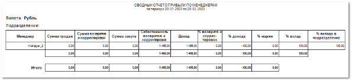
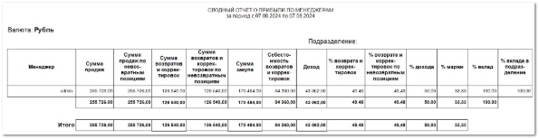

**Сводный отчет о прибыли по менеджерам** отображает данные об эффективности продаж каждого менеджера за указанный период.

Отчет содержит:

- Период, за который сформирован отчет, в соответствии с выбранными в параметрах;

- Валюту операций отчета;

- Подразделение, по которому сформирован отчет (если не выбрано, отчет сформируется по всем подразделениям);

- **Табличную часть** для каждого подразделения, которая включает в себя следующую информацию:

    - **Менеджер** – имя менеджера (при отсутствии имени будет указан логин пользователя, который оформил продажи);

    - **Сумма продаж** – сумма, на которую менеджер оформил продажи;

    - **Сумма возвратов и корректировок** – сумма, на которую по продажам менеджера были оформлены возвраты/корректировки;

    - **Сумма закупа** – сумма, на которую менеджер совершил заказы по позициям;

    - **Себестоимость возвратов и корректировок** – сумма по возвращенным и скорректированным заказным позициям;

    - **Доход** – сумма, которую менеджер по итогу положил в кассу: *сумма продаж - сумма закупа - сумма возвратов - сумма корректировок + себестоимость возвратов + себестоимость корректировок*;

    - **% возврата и корректировок** – процент отношения **Суммы возвратов и корректировок** к **Сумме продаж**;

    - **% дохода** – процент отношения **Дохода** к **Сумме продаж**;

    - **% маржи** – процент отношения **Себестоимости товаров** к их **Сумме продаж**;

    - **% вклад** – процент от общего **Дохода** среди всех менеджеров;

    - **% вклада в подразделение** – процент от общего **Дохода** среди менеджеров подразделения;

- Итоговые показатели по подразделению;

- Блок **Итого** – общие показатели по всем подразделениям.

Также для данного отчета доступен дополнительный печатный бланк **Сводный отчет о прибыли по менеджерам с учетом признака возврата**, который дополнительно содержит информацию:

- **Сумма продаж по невозвратным позициям** – выводит сумму, на которую менеджер оформил продажи товаров с признаком возврата **Возврат невозможен**;

- **Сумма возвратов и корректировок по невозвратным позициям** – выводит сумму, на которую по продажам менеджера были оформлены возвраты\корректировки позиций с признаком возврата. При расчете значения в колонке учитываются позиции с признаком возврата **Возврат невозможен** из документов **Возвраты поставщикам** и **Корректировки расходных накладных**;

- **% возврата и корректировок по невозвратным позициям** – выводит общий процент возврата по невозвратным позициям в итоге.