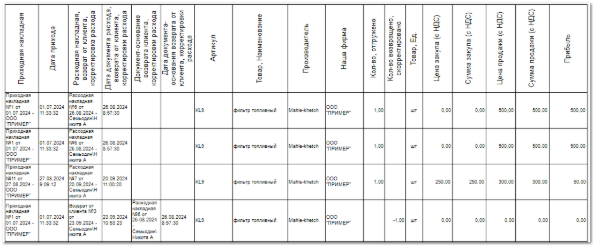
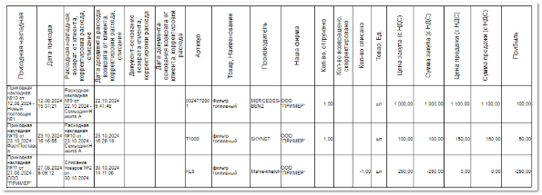

**Отчет о прибыли в разрезе прихода** отображает данные о прибыли по каждому приходу отдельно.

Отчет содержит **Табличную часть**:

- **Приходная накладная** – дата и номер документа прихода, поставщик, от которого оформлен приход;

- **Дата прихода** – дата прихода и время прихода;

- **Расходная накладная, возврат от клиента, корректировка расхода** – дата, номер документа расхода/возврата/корректировки расхода (один из документов), клиент (покупатель), на которого оформлен документ;

- **Дата документа расхода, возврата от клиента, корректировки расхода** – дата и время расхода/возврата/корректировки расхода (одного из документов);

- **Документ-основание возврата клиента, корректировки расхода** – дата, номер документа-основания (расхода), клиент (покупатель), на которого оформлен расход;

::: note Замечание

Поле будет заполнено только в случае, если в столбце **Расходная накладная, возврат от клиента, корректировка расхода** указан не расходный документ.

:::

- **Дата документа-основания возврата от клиента, корректировки расхода** – дата и время расхода, на основании которого оформлен возврат клиента/корректировка расхода;

::: note Замечание

Поле будет заполнено только в случае, если указан **Документ-основание возврата клиента, корректировки расхода**.

:::

- **Артикул** – артикул товара, по которому оформлен документ;

- **Товар, Наименование** – название товара, по которому оформлен документ;

- **Производитель** – название производителя товара;

- **Наша фирма** – название **Нашей фирмы**, которая провела операцию;

- **Кол-во, отгружено** – количество единиц товара, по которым оформлен расход;

- **Кол-во возвращено, скорректировано** – количество единиц товара, по которым оформлен возврат/корректировка расхода;

- **Товар, Ед.** – единица измерения товара;

- **Цена закупа (с НДС)** – стоимость закупки одной единицы товара с учетом НДС;

- **Сумма закупа (с НДС)** – суммарная стоимость за покупки всех единиц товара с учетом НДС;

- **Цена продажи (с НДС)** – стоимость продажи одной единицы товара с учетом НДС;

- **Сумма продажи (с НДС)** – суммарная стоимость продажи всех единиц товара с учетом НДС;

- **Прибыль** – сумма, которую фирма фактически получает после проведения операции (разница между **Суммой продажи** и **Суммой закупа**).

Также для данного отчета доступен дополнительный печатный бланк **Отчет о прибыли в разрезе прихода и списаний**, который** отображает аналогичные данные **Отчета о прибыли в разрезе прихода** с добавлением товаров из раздела **Склад и закупки ► Списания товаров**.

Отчет содержит **Табличную часть**:

- **Приходная накладная** – дата и номер документа прихода, поставщик, от которого оформлен приход;

- **Дата прихода** – дата прихода и время прихода;

- **Расходная накладная, возврат от клиента, корректировка расхода, списание** – дата, номер документа расхода/возврата/корректировки расхода/списания (один из документов), клиент (покупатель), на которого оформлен документ;

- **Дата документа расхода, возврата от клиента, корректировки расхода, списания** – дата и время расхода/возврата/корректировки расхода/списания (одного из документов);

- **Документ-основание возврата клиента, корректировки расхода** – дата, номер документа-основания (расхода), клиент (покупатель), на которого оформлен расход;

::: note Замечание

Поле будет заполнено только в случае, если в столбце **Расходная накладная, возврат от клиента, корректировка расхода, списания** не указаны документы расхода или списания.

:::

- **Дата документа-основания возврата от клиента, корректировки расхода** – дата и время расхода, на основании которого оформлен возврат клиента/корректировка расхода;

::: note Замечание

Поле будет заполнено только в случае, если указан **Документ-основание возврата клиента, корректировки расхода**.

:::

- **Артикул** – артикул товара, по которому оформлен документ;

- **Товар, Наименование** – название товара, по которому оформлен документ;

- **Производитель** – название производителя товара;

- **Наша фирма** – название **Нашей фирмы**, которая провела операцию;

- **Кол-во, отгружено** – количество единиц товара, по которым оформлен расход;

- **Кол-во возвращено, скорректировано** – количество единиц товара, по которым оформлен возврат/корректировка расхода;

- **Количество списано** – отрицательное количество единиц товара, по которым оформлено списание;

- **Товар, Ед.** – единица измерения товара;

- **Цена закупа (с НДС)** – стоимость закупки одной единицы товара с учетом НДС;

- **Сумма закупа (с НДС)** – суммарная стоимость за покупки всех единиц товара с учетом НДС;

- **Цена продажи (с НДС)** – стоимость продажи одной единицы товара с учетом НДС;

- **Сумма продажи (с НДС)** – суммарная стоимость продажи всех единиц товара с учетом НДС;

- **Прибыль** – сумма, которую фирма фактически получает после проведения операции (разница между **Суммой продажи** и **Суммой закупа**).