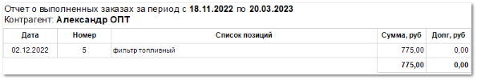

**Отчет о выполненных заказах** отображает данные об исполненных заказах за указанный период.

Отчет содержит:

- Период, за который сформирован отчет, в соответствии с выбранными в параметрах;

- Контрагент, по которому сформирован отчет;

- **Табличную часть** , которая включает в себя следующую информацию:

    - **Дата** – дата совершения операции;

    - **Номер** – номер заказа;

    - **Список позиций** – позиции, которые были включены в заказ. Отображается наименование позиций. При отсутствии у позиции наименования будет отображен артикул;

    - **Сумма, руб** – суммы, начисленные по заказам в основной валюте;

    - **Долг, руб** – сумма долга по заказу в основной валюте;

- Общую начисленную сумму по всем заказам;

- Общую сумму долга по всем заказам.