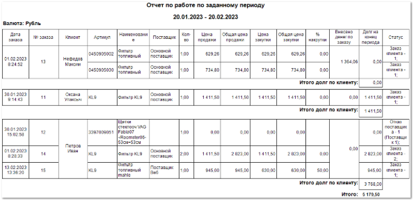

Шаблон **Отчет по работе по заданному периоду** содержит подробные данные по заказам клиентов за выбранный период.

Отчет содержит:

- Период, за который сформирован отчет, в соответствии с выбранными в параметрах;

- Валюту операций отчета;

- **Табличную часть**  для каждого клиента, которая включает в себя следующую информацию:

    - **Дата заказа**  – дата оформления заказа;

    - **№ заказа**  – идентификатор заказа;

    - **Клиент**  – название клиента, который совершил заказ;

    - **Артикул**  – код товара, включенного в заказ;

    - **Наименование**  – название позиции, включенной в заказ;

    - **Поставщик**  – название поставщика товара;

    - **Кол-во**  – количество товара с одинаковым артикулом и ценой продажи в конкретном заказе;

    - **Цена продажи**  – сумма, по которой клиенту была продана одна позиция с одинаковым артикулом и ценой;

    - **Общая цена продажи**  – сумма, по которой клиенту были проданы все позиции с одинаковым артикулом и ценой;

    - **Цена закупки**  – сумма, по которой была закуплена одна позиция с одинаковым артикулом и ценой у поставщика;

    - **Общая цена закупки**  – сумма, по которой были закуплены все позиции с одинаковым артикулом и ценой у поставщика;

    - **% накрутки**  – процент, на который увеличена цена закупки для формирования цены продажи;

    - **Внесено денег по заказу**  – сумма, оплаченная клиентом при оформлении заказа;

    - **Долг на конец периода**  – сумма, которую клиент не оплатил по заказу на конец выбранного периода;

    - **Статус**  – состояние, в котором находится позиция. Возможные следующие состояния позиции:

        - **Возврат от клиента – # (торг.точка)** ;

        - **Заказ клиента – #** ;

        - **Заказ поставщику – # (Поставщик) (Сообщение)** ;

        - **Заказ-наряд – #** ;

        - **Кор. Расхода – # (торг.точка)** ;

        - **Отказ клиента – # (торг.точка)** ;

        - **Отказ поставщика – # (Поставщик)** ;

        - **Расход – #** ;

        - **Резерв – # (торг.точка)** .

            Где:

            - **#**  – количество позиций;

            - **(торг. точка)**  – торговая точка, на которой возвращена/зарезервирована позиция либо произведена корректировка расхода;

            - **(Поставщик)**  – название поставщика;

            - **(Сообщение)**  –ответ поставщика по заказной позиции.

::: info Примечание

Некоторые параметры могут быть не указаны.

:::

- **Итого долг по клиенту**  – общая сумма долга по каждому клиенту;

- **Итого**  – общая сумма долга по всем клиентам.