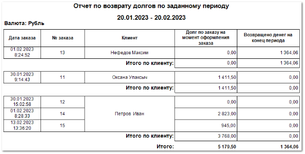

Шаблон **Отчет по возврату долгов по заданному периоду** отображает данные о наличии и суммах задолженностей клиентов по заказам.

Отчет содержит:

- Период, за который сформирован отчет, в соответствии с выбранными в параметрах;

- Валюту операций отчета;

- **Табличную часть**  для каждого клиента, которая включает в себя следующую информацию:

    - **Дата заказа** – дата оформления заказа;

    - **№ заказа** – идентификатор заказа;

    - **Клиент** – название клиента, который совершил заказ;

    - **Долг по заказу на момент оформления заказа** – сумма, неоплаченная клиентом при оформлении заказа;

    - **Возвращено денег на конец периода** – сумма, которую клиент оплатил по заказу на конец выбранного периода;

- **Итого по клиенту** – общие суммы долга и оплат по каждому клиенту;

- **Итого** – общие суммы долга и оплат по всем клиентам.