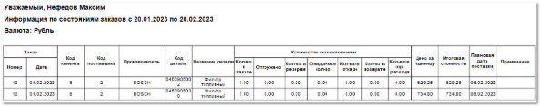

Шаблон **Заказы клиента с детализацией по состояниям** отображает подробные данные по заказам клиентов за выбранный период.

Отчет содержит:

- Название клиента, для которого сформирован отчет (для каждого выбранного клиента формируется отдельный отчет. Если клиенты не выбраны, то отчет формируется для всех клиентов);

- Период, за который сформирован отчет, в соответствии с выбранными в параметрах;

- Валюту операций отчета;

- **Табличную часть** , которая включает в себя следующую информацию:

    - **Заказ (Номер, Дата)**  – общий порядковый номер и дата заказа;

    - **Код клиента**  – идентификатор клиента;

    - **Код поставщика**  – идентификатор поставщика;

    - **Производитель**  – название производителя товара;

    - **Код детали**  – артикул товара, с которым проведена операция;

    - **Название детали**  – название товара, по которому оформлен документ;

    - Количество по состояниям:

        - **Кол-во в заказе**  – количество позиций, добавленных в заказ клиента, по которым не было дальнейшего движения (позиции в состоянии **Заказ клиента**);

        - **Отгружено**  – количество позиций, отгруженных клиенту (позиции в состоянии **Расход**, по которым сформирована **Расходная накладная**);

        - **Кол-во в резерве**  – количество позиций, зарезервированных для клиента (позиции в состоянии **Резерв**);

        - **Ожидаемое кол-во**  – количество позиций, по которым оформлен **Заказ поставщику** (позиции в состоянии **Заказ поставщику**);

        - **Кол-во в отказе**  – количество позиций, по которым клиент отказался от заказа (по позиции в состоянии **Отказ клиента**);

        - **Кол-во в возврате**  – количество позиций, которые были возвращены клиентом (позициям в состоянии **Возврат от клиента**);

        - **Кол-во в кор. расхода**  – количество позиций, по которым производилась **Корректировка расхода** (позиции в состоянии **Кор. расхода**);

    - **Цена за единицу**  – стоимость одной позиции товара;

    - **Итоговая**  стоимость – стоимость всех позиций товара с совпадающим артикулом и производителем;

    - **Плановая дата поставки**  – ожидаемая дата, когда заказная позиция будет доставлена на торговую точку;

    - **Примечание**  – дополнительная информация по позициям. Например, о неудачной попытке подбора. Данные берутся из одноименной колонки в заказе клиента.

::: details Читайте также

- [Документы Заказы клиентов](../../../../specification/crm/zakazy_klientov.md)

- [Документы Расходные накладные](../../../../specification/prodazhi/rashodnye_nakladnye/rashodnye_nakladnye.md)

- [Документы Резервирования](../../../../specification/crm/rezervirovanija.md)

- [Документы Заказы поставщикам](../../../../specification/sklad_i_zakupki/zakazy_postavschikam.md)

- [Документы Отказы клиентов](../../../../specification/crm/otkazy_klientov.md)

- [Документы Возвраты от клиентов](../../../../specification/prodazhi/vozvraty_ot_klientov/vozvraty_ot_klientov.md)

- [Документы Корректировки расходных накладных](../../../../specification/prodazhi/korrektirovki_rashodnyh_nakladnyh/korrektirovki_rashodnyh_nakladnyh.md) 

:::

