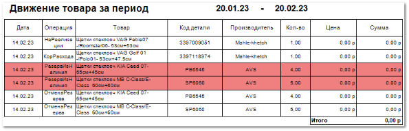

В отчете отображается информация по движению товара за выбранный период.

Отчет **Движение товара** содержит:

- Период, за который сформирован отчет, в соответствии с выбранными в параметрах;

- **Табличную часть**, которая включает в себя следующую информацию:

    - **Дата** – дата операции (продажи, возврата, резерва и т.д.);

    - **Операция** – название вида операции (**Приход**, **РезервПодЗаказ**, **РезервИзНаличия**, **Расход**, **Кор.Расхода**, **ЗаказНаряд**, **ВозвратОтКлиента**, **СписаниеТоваров**);

    - **Товар** – наименование позиции, по которой проводилась операция;

    - **Код детали** – артикул товара, с которым проведена операция;

    - **Производитель** – наименование производителя детали;

    - **Кол-во** – количество товара, по которому была произведена операция;

    - **Цена** – стоимость за единицу товара;

    - **Сумма** – стоимость товара с учетом количества;

    - **Итого** – итоговая сумма всех произведенных и отобранных при формировании отчета операций.