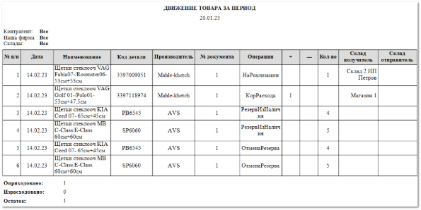

В отчете отображается общая информация по товарообороту в разрезе заданного периода, в том числе **Перемещения** между складами Нашей фирмы.

Отчет **Движение товара развернуто** содержит:

- Начальная дата периода, за который сформирован отчет, в соответствии с выбранными в параметрах;

- Информация с параметрами отчета: **Контрагент**, **Наша** **фирма**, **Склады**, в соответствии с выбранными в параметрах формирования отчета;

- **Табличную часть**, которая включает в себя следующую информацию:

    - **№ п/п** – порядковый номер записи в таблице;

    - **Дата** – дата операции (продажи, возврата, резерва и т.д.);

    - **Наименование** – наименование позиции, по которой проводилась операция;

    - **Код детали** – артикул товара, с которым проведена операция;

    - **Производитель** – наименование производителя детали;

    - **№ документа** – порядковый номер созданного документа;

    - **Операция** – название вида операции (**Приход**, **РезервПодЗаказ**, **РезервИзНаличия**, **Расход**, **Кор.Расхода**, **ЗаказНаряд**, **ВозвратОтКлиента**);

    - **+** – количества на которое произошло увеличение товара на складе;

    - **–** – количество на которое произошло уменьшение товара на складе;

    - **Кол-во** – количество товара, по которому была произведена **Операция**, которая не повлекла за собой изменения количества товара на складах;

    - **Склад получатель** – наименование склада оприходования товара;

    - **Склад отправитель** – наименование склада с которого отпускается товар;

- **Оприходовано** – количество оприходованного товара за выбранный период;

- **Израсходовано** – количество израсходованного товара за выбранный период;

- **Остаток** – количество единиц товара на конец заданного периода (количество **Оприходованного** товара – количество **Израсходованного**).