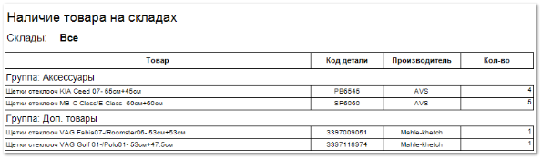

Отчет отражает информацию о товаре и количестве товара, которое было на складах в заданном периоде.

Отчет **Наличие товара** содержит:

- Информацию о **Складах**, по которым был сформирован отчет, в соответствии с выбранными в параметрах формирования отчета;

- **Табличную часть**, которая включает в себя следующую информацию:

    - **Товар** – наименование позиции;

    - **Код детали –** артикул товара;

    - **Производитель** – наименование производителя товара;

    - **Кол-во** – количество товара, которое находилось на складе в заданном периоде.