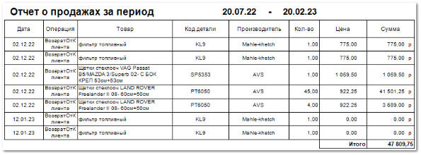

Отчет  позволяет оценить продажи и возвраты от покупателей, созданные конкретным пользователем за выбранный период. 

::: info Примечание

При формировании отчете не учитывается значение настройки **Менеджер клиента** в карточке **Контрагента**, в отчет попадают документы, созданные пользователем на любого покупателя.

:::

**Отчет о продажах за период** содержит:

- Период, за который сформирован отчет, в соответствии с выбранными в параметрах;

- **Табличную часть**, которая включает в себя следующую информацию:

    - **Дата –** дата документа по заданной операции;

    - **Операция** – название вида операции, определяется по созданному документу (**Расход**, **ВозвратОтКлиента**, **ЗаказНаряд**);

    - **Товар** – наименование товара, по которому была произведена операция;

    - **Код детали** – артикул товара;

    - **Производитель** – наименование производителя товара;

    - **Кол-во** – количество товара, с которым была произведена операция;

    - **Цена** – стоимость за единицу товара;

    - **Сумма** – стоимость товара с учетом количества;

    - **Итого** – общая сумма значений из колонки **Сумма**.