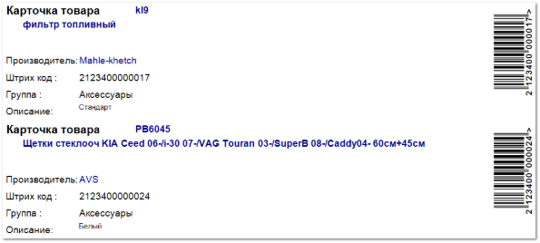

Отчет позволяет сгенерировать карточки для товаров из **Прайс-листов из наличия**, в которых выводится основная информация о позиции, а также штрихкод по которому можно осуществлять продажу товара.

::: warning Внимание!

Карточки продукта формируются только для позиций, которые на данный момент есть в наличии.

:::

В **Карточке товара** содержится:

- **Код товара** – артикул товара;

- **Наименование товара** – название товара**;**

- **Производитель** – наименование производителя товара;

- **Штрих код** (номер);

- **Штрих код** (изображение);

- **Группа** – наименование группы товара из заданных в справочнике **Товаров**;

- **Описание** – описание товара из **Карточки товара**.