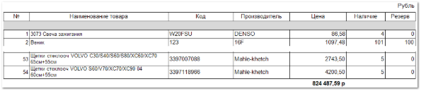
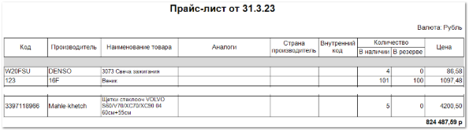
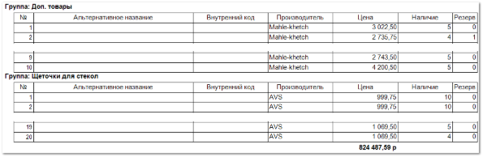
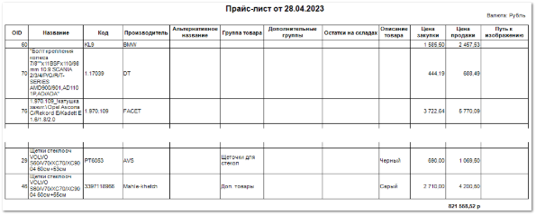

Отчет позволяет выгрузить прайс-лист товаров из наличия с заданными настройками.

Для формирования прайс-листа доступно несколько шаблонов:

- **Прайслист** – в шаблоне **Прайслист** отсутствуют колонки: **OID**, **Альтернативное название**, **Дополнительные группы**, **Остатки на складах**, **Описание товара**, **Цена закупки**, **Аналоги**, **Страна производитель**, **Внутренний код**, **Путь к изображению**.

- **Прайслист\_аналоги** – в шаблоне **Прайслист\_аналоги** отсутствуют колонки: **№**, **OID**, **Альтернативное название**, **Дополнительные группы**, **Остатки на складах**, **Описание товара**, **Цена закупки**, **Путь к изображению**.

- **Прайслист\_группы** – в шаблоне **Прайслист\_группы** отсутствуют колонки: **OID**, **Код**, **Дополнительные группы**, **Остатки на складах**, **Описание товара**, **Цена закупки**, **Аналоги**, **Страна производитель**, **Путь к изображению**.

- **Прайслист\_подробный** – в шаблоне **Прайслист\_подробный** отсутствуют колонки: **№**, **Аналоги**, **Страна производитель**, **Внутренний код**, **Наличие**, **Резерв**.

В выгруженном прайс-листе содержится:

- Дата, от которой был сформирован отчет;

- **Валюта**, в которой сформирован отчет;

- Наименование **Группы товаров**;

- **Табличная часть**, которая включает в себя следующую информацию:

    - **№** – порядковый номер записи в таблице;

    - **OID** – уникальный номер товара в базе данных;

    - **Наименование товара** – название позиции;

    - **Код** – артикул товара;

    - **Производитель** – наименование производителя товара;

    - **Альтернативное название** – альтернативное наименование товара, заданное в карточке товара;

    - **Дополнительные группы** – наименование дополнительных групп, заданных для товара;

    - **Остатки на складах** – количество товара на складах;

    ::: info Примечание

    Для выведения данных в колонке необходимо проставить флажок **Вычислять информацию: Дополнительные группы, Остатки на других складах, Пути к фотографиям** в параметрах формирования отчета.

    :::
    - **Описание товара** – описание товара, заданное в карточке товара;

    - **Цена закупки** – цена закупа позиции у поставщика из документа **Приходная накладная**;

    - **Цена** – цена продажи за единицу товара на основании заданных маркетингов;

    - **Аналоги** – аналоги товара из справочника **Аналогов**;

    - **Страна производитель** – значение **Страны-изготовителя** из карточки товара;

    - **Внутренний код** – значение поля **Внутренний код** из справочника **Товаров**;

    - **Наличие** – количество товара в наличии на доступных складах в свободном остатке;

    - **Резерв** – количество товара, зарезервированного под покупателей;

    - **Путь к изображению** – путь к изображению, который задан в справочнике **Товаров**.

::: info Примечание

Корневой каталог, в котором хранятся изображения задается в настройке **Путь к каталогу с изображениями** в разделе **Управление** ► **Настройки программы ► Настройки**, группа **Системные настройки**.

:::

::: details Читайте также

- [Добавление карточки товара](../../../../work/nomenklatura/tovary/dobavlenie_kartochki_tovara.md)

- [Документы Приходные накладные](../../../../specification/sklad_i_zakupki/prihodnye_nakladnye.md)

- [Справочник Аналоги](../../../../specification/tovary_i_tseny/analogi/analogi.md)

- [Настройки программы - Настройки - Системные настройки](../../../../specification/upravlenie/nastrojki_programmy/nastrojki/sistemnye_nastrojki.md) 

:::

