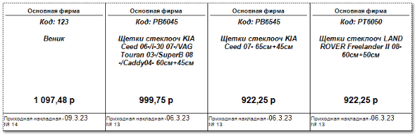

В соответствии с заданными параметрами, отчет позволяет сформировать ценники для товаров.

При создании ценников доступен выбор ценников разного размера, в соответствии с выбранным шаблоном:

- **Ценник 49×39**;

- **Ценник 49×39 (gala)**;

- **Ценник 49×39 \_new**;

- **Ценник 58×51**;

- **Ценник 58×51 (gala)**;

- **Ценник (4 по ширине)**;

- **Ценник (6 по ширине)**;

- **Ценники**;

- **Этикетка 58×30 с ценой и стратегией печати**.

::: info Примечание

**Ценник (4 по ширине)**, **Ценник (6 по ширине)**, **Ценники**, **Этикетка 58×30 с ценой и стратегией печати** дополнительно содержат штрихкоды.

:::

На ценнике, в зависимости от выбранного шаблона, отображается информация:

- Наименование **Нашей фирмы**;

- **Код** – артикул детали;

- **Наименование детали**;

- **Цена продажи** за единицу товара на основании заданных маркетингов;

- Информация о **Приходной накладной**, из которой позиция была добавлена в прайс-лист наличия.