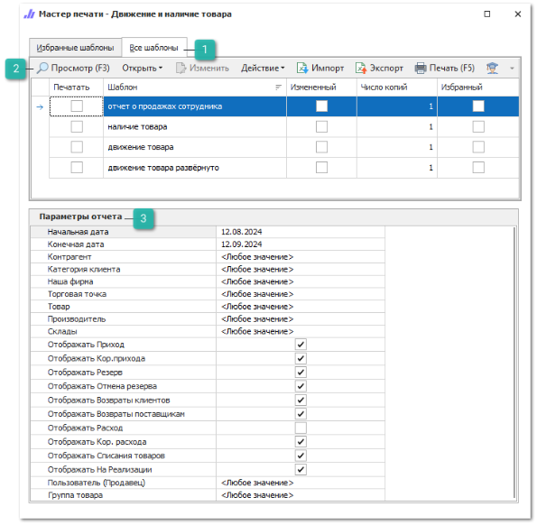
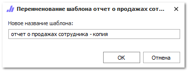

Чтобы сформировать **Складской отчет** выполните следующие действия:

**»** Откройте раздел **Отчеты и анализ ► Складские отчеты**,

**»** Выберите требуемый вариант отчета.

 **Все шаблоны**

Список доступных шаблонов отчета, позволяет выбрать необходимый для формирования отчет, а так же добавить шаблона в избранные.

 **Панель действий**

Панель состоит из следующих команд:

- **Просмотр (F3)** – позволяет открыть печатную форму для просмотра перед печатью;

- **Открыть** – позволяет открыть документ в выбранном формате. Содержит выпадающий список со следующими командами:

    - **В Word** – позволяет открыть документ в формате **\*.docx**;

    - **В Excel** – позволяет открыть документ в формате **\*.xlsx**;

    - **В PDF** – позволяет открыть документ в формате **\*.pdf**.

- **Изменить** – позволяет открыть редактор шаблонов для внесения изменений;

::: note Замечание

Команда недоступна при редактировании стандартных шаблонов. Редактирование доступно только для шаблонов, которые были скопированы (команда **Действие** ► **Копировать**) или импортированы (команда **Импорт**).

:::

- **Действие** – содержит выпадающий список команд для взаимодействия с шаблоном:

    - **Удалить** – удаляет выбранный шаблон. Команда доступна при выборе только измененных шаблонов;

    - **Копировать** – копирует выбранный шаблон. При нажатии на команду производится открытие окна с вводом наименования нового шаблона;

    - **Переименовать** – позволяет открыть окно для изменения наименования шаблона. Команда доступна только для шаблонов, которые не являются стандартными.

::: note Замечание

Сохранение шаблона недоступно, если: 

- название содержит спец. символы "\",  "/",  ":",  "\*",  "?",  """, "<",  ">",  "|"; 

- название не указано; 

- название и тип шаблона совпадают с уже имеющимся в базе данных.

:::

- **Импорт** – позволяет загрузить файл с шаблоном в расширении \*.mrt;

- **Экспорт** – позволяет выгрузить выделенный в табличной части шаблон, в файл с расширением \*.mrt;

- **Печать (F5)** – позволяет распечатать выбранные шаблоны;

- **Помощь** – позволяет открыть руководство пользователя на странице описания формы мастера печати.

 **Параметры отчета**

Позволяет задать необходимые параметры, наборы параметров отличаются в зависимости от выбранного отчета:

- **Товар** / **Выбранные товары** – выбор конкретного товара/ списка товаров для формирования отчета;

- **Группа товара** – выбор группы товаров, по которой будет формироваться отчет. Доступен выбор только одной группы;

- **Производитель** / **Производитель [Товар]** / **Производитель товара** – выбор производителя для формирования отчета. При формировании отчета будут учтены синонимы. Доступен выбор только одного производителя;

- **Категория клиента** / **Категории клиентов** / **Категория клиентов для формирования / Уровень цен** – выбор категории клиента для формирования отчета;

- **Наша фирма** – выбор фирмы, информация о складских остатках которой попадет в отчет. Доступен выбор одной фирмы;

- **Торговая точка** – значение торговой точки, товарные остатки которой попадут в отчет. Доступен выбор одной или нескольких Торговых точек;

- **Склады / Склад / Места хранения/Склады / Анализируемые склады / Склады/ТТ / Склады/Торговые точки** – выбор складов, товарные остатки которых попадут в отчет. К выбору доступны склады и торговые точки из раздела **Склад и закупки ► Склады/ Торговые точки** (для выбора доступно одно или несколько значений);

- **Отображать Приход** – выводить информацию о приходах, созданных не на основании **Заказа клиента**;

- **Отображать Резерв** – выводить информацию о товарах, находящихся в документах **РезервИзНаличия** и **РезервПодЗаказ**;

- **Отображать Отмена резерва** – выводить информацию о позициях из отмененных документов резервирования;

::: warning Внимание!

Выведение информации по настройке **Отображать Отмена резерва** доступно только при активной настройке **Отображать Резерв**.

:::
- **Отображать Возвраты Клиентов** – выводить информацию из документов **Возвраты клиентов** за заданный период;

- **Отображать На Реализации** – выводить информацию о позициях из документа **Отгрузка на реализацию**;

- **Отображать Расход** – отображать расходные документы, на основании которых со склада были списаны позиции;

- **Отображать Кор**. **расхода** – выводить информацию о созданных корректировках расхода по позициям, на основании корректировочных документов в заданном периоде;

::: info Примечание

Выведение информации по настройке **Отображать Кор. расхода** доступно только при активной настройке **Отображать Расход**.

:::

- **Вычислить до даты** – настройка доступна в отчетах, в параметрах которых отсутствуют настройки **Начальная** и **Конечная дата**. Обозначает дату, до которой будет сделано ограничение по выведению **Операций** с товарами, и значение даты, относительно которой будут выведены складские остатки.

- **Учитывать вложенные группы товаров** – при активной настройке вложенные группы товаров будут отображаться в отчете;

- **Дней на складе без продаж, от**/ **Количество дней без продаж, более** – настройки для выведения информации о неликвидных товарах из наличия, которые не продаются заданное количество дней.

- **Валюта / Валюта выгрузки** – выбор валюты для конвертации сумм в отчете с учетом действующего курса валюты. Параметр обязателен для заполнения. Доступен выбор только одной валюты;

- **Выводить в лог пропущенные позиции** – позволяет сформировать лог-файл с пропущенными позициями (при формировании отчета файл будет открыт в виде отдельного файла в Блокноте);

- **Пользователь (Продавец)**/ **Автор** – выбор пользователей, по которым должен быть сформирован отчет. Доступен выбор только одного пользователя;

- **Контрагент** – выбор контрагента, по которому будет сформирован отчет. Доступен выбор только одного контрагента;

- **Отображать Кор.прихода** – выводить информацию о корректировках приходных накладных за заданный период;

- **Отображать Возвраты поставщикам** – выводить информацию о возвратах поставщику за заданный период;

- **Отображать Списания товаров** – выводить информацию о списаниях товаров за заданный период;

- **Поставщики** – наименование поставщиков от которых пришли детали.

**»** Выберете шаблон, на основе которого нужно сформировать отчет.

**»** В блоке **Параметры отчета** задайте необходимые параметры.

**»** Откройте отчет в необходимой программе или распечатайте его.

::: details Читайте также

- [Складские отчеты](../../../specification/otchety_i_analiz/skladskie_otchety/dvizhenie_i_nalichie_tovara.md)

- [Справочник Склады/Торговые точки](../../../specification/sklad_i_zakupki/skladytorgovye_tochki.md) 

:::