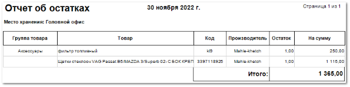

Отчет позволяет увидеть весь перечень товаров на складах на выбранную дату.

Отчет содержит:

- Дату, относительно которой выведено значение товарных остатков на складе, значение даты берется из настройки **Вычислять до даты**, которая задается при формировании отчета;

- **Место хранения**, по которому был сформирован отчет, в соответствии с выбранными в параметрах;

- **Табличную часть**, которая включает в себя следующую информацию:

- **Группа товара** – наименование группы товара из заданных в справочнике **Товаров**;

- **Товар** – наименование товара;

- **Код** – артикул товара;

- **Производитель** – наименование производителя товара;

- **Остаток** – количество единиц товара на складе;

- **На сумму** – закупочная цена (с НДС) на общее количество позиций на складе (значение из колонки **Остаток**);

- **Итого** – общее значение суммы товарных остатков.

::: details Читайте также

- [Справочник Товары](../../../../specification/tovary_i_tseny/tovary/README.md) 

:::