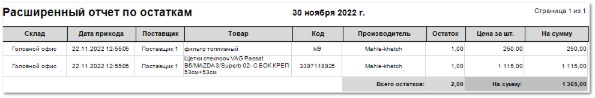

Отчет отражает состояние дел по товару из наличия в разрезе документов **Приходная накладная**.

**Расширенный отчет по остаткам** содержит:

- Дату, относительно которой выведено значение товарных остатков на складе, значение даты берется из настройки **Вычислять до даты**, которая задается при формировании отчета;

- **Табличную часть**, которая включает в себя следующую информацию:

    - **Склад** – место хранения позиции;

    - **Дата прихода** – дата оприходования позиции на склад в раздел **Склад и закупки** **► Приходные накладные**;

    - **Поставщик** – наименование поставщика из документа прихода по позиции;

    - **Товар** – наименование товара;

    - **Код** – артикул товара;

    - **Производитель** – наименование производителя товара;

    - **Остаток** – количество единиц товара на складе;

    - **Цена за шт**. – закупочная цена за единицу товара;

    - **На сумму** – закупочная цена (с НДС) на общее количество позиций на складе (значение из колонки **Остаток**);

    - **Всего остатков** – общее количество единиц товара на складе/ складах (сумма значений из колонки **Остаток**);

    - **На сумму** – общее значение суммы товарных остатков.

::: details Читайте также

- [Документы Приходные накладные](../../../../specification/sklad_i_zakupki/prihodnye_nakladnye.md) 

:::