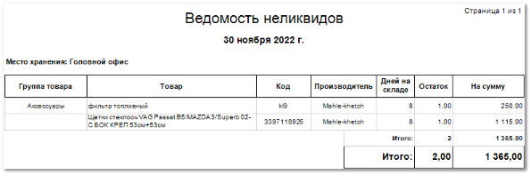

Отчет позволяет отобразить товары в наличии, по которым не было продаж более указанного количества дней. В рамках отчета можно оценить состав и количество неликвидов независимо по каждому складу, либо в рамках всех складов.

Отчет содержит:

- Дату, относительно которой выведено значение товарных остатков на складе, значение даты берется из настройки **Вычислять до даты**, которая задается при формировании отчета;

- **Место хранения**, по которому был сформирован отчет, в соответствии с выбранными в параметрах;
 
- **Табличную часть**, которая включает в себя следующую информацию:

    - **Группа товара** – наименование группы товара из заданных в справочнике **Товаров**;

    - **Товар** – наименование товара;

    - **Код** – артикул товара;

    - **Производитель** – наименование производителя товара;

    - **Дней на складе** – количество календарных дней, которое товар находится на складе, значение выводится по убыванию (количество дней на складе определяется в соответствии с приходными документами в разделе **Склад и закупки** **► Приходные накладные**);

    ::: info Примечание

    Если на складе есть одинаковые позиции, поступление по которым было занесено в разные дни, то такие позиции выводятся в отчете в отдельные строки. В начале выводится позиция с меньшим количеством дней на складе, а сразу под ней выводится позиция с большим количеством дней на складе.

    :::
    **Остаток** – количество единиц товара на складе;

    **На сумму** – закупочная цена позиции (с НДС) с учетом **Остатка**;

    **Итого** – итоговое значение единиц товара на складе, а также сумма закупа всех товаров для позиций, которые находятся на складе без продаж заданное количество дней.

::: details Читайте также

- [Справочник Товары](../../../../specification/tovary_i_tseny/tovary/README.md) 

:::